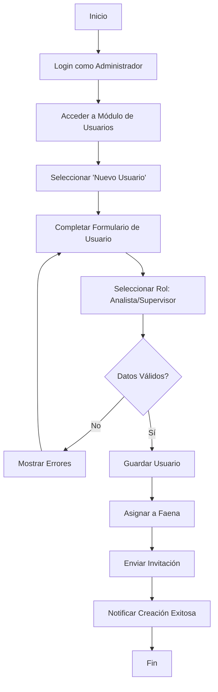
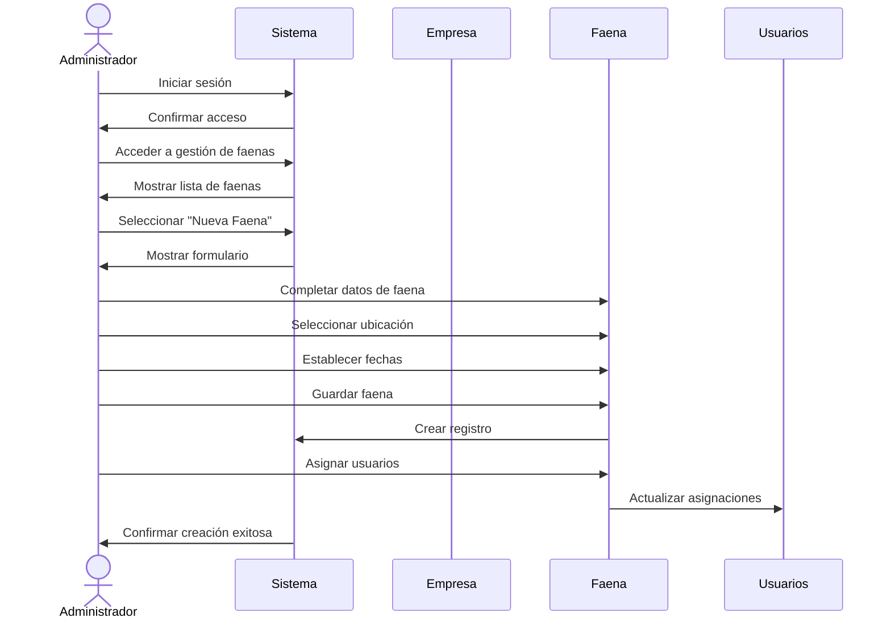
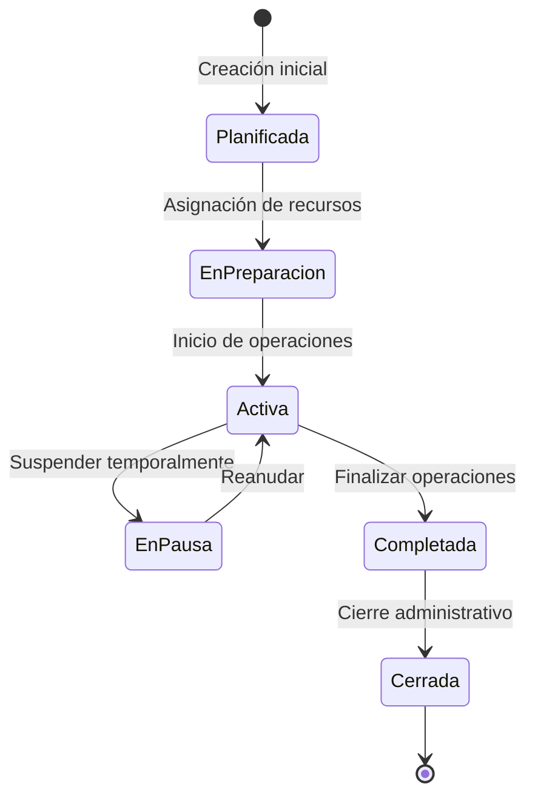
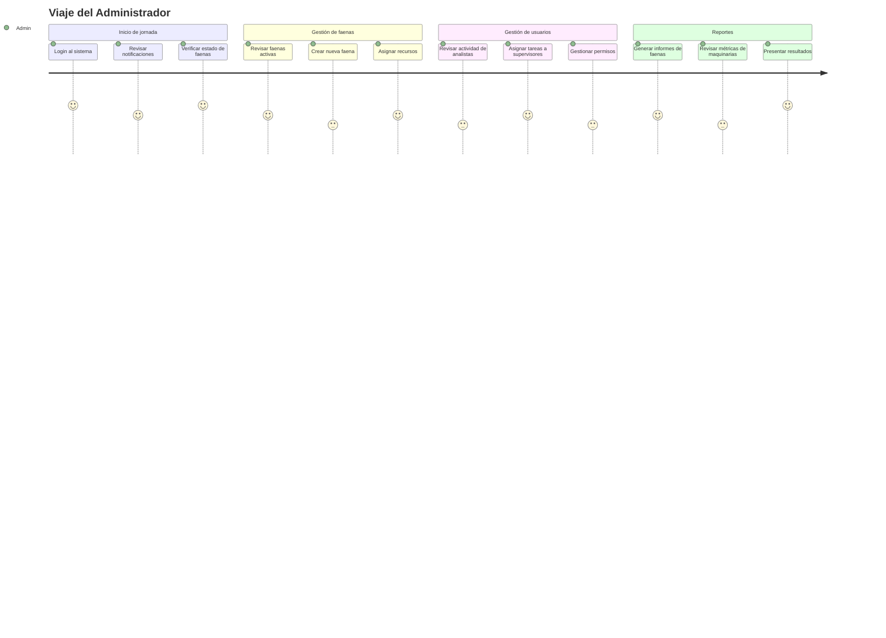

# Flujos de Usuario: Administrador

Este documento presenta los diagramas que ilustran los flujos y procesos del Administrador en el sistema Multotec.

## Diagrama de Flujo: Gestión de Usuarios de Empresa

## Diagrama de Secuencia: Creación de Faena

## Diagrama de Estado: Ciclo de Vida de una Faena

## Diagrama de Viaje del Usuario: Administrador

