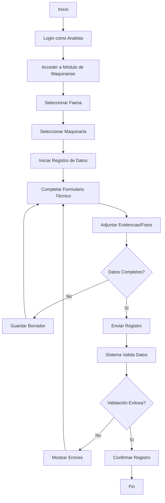
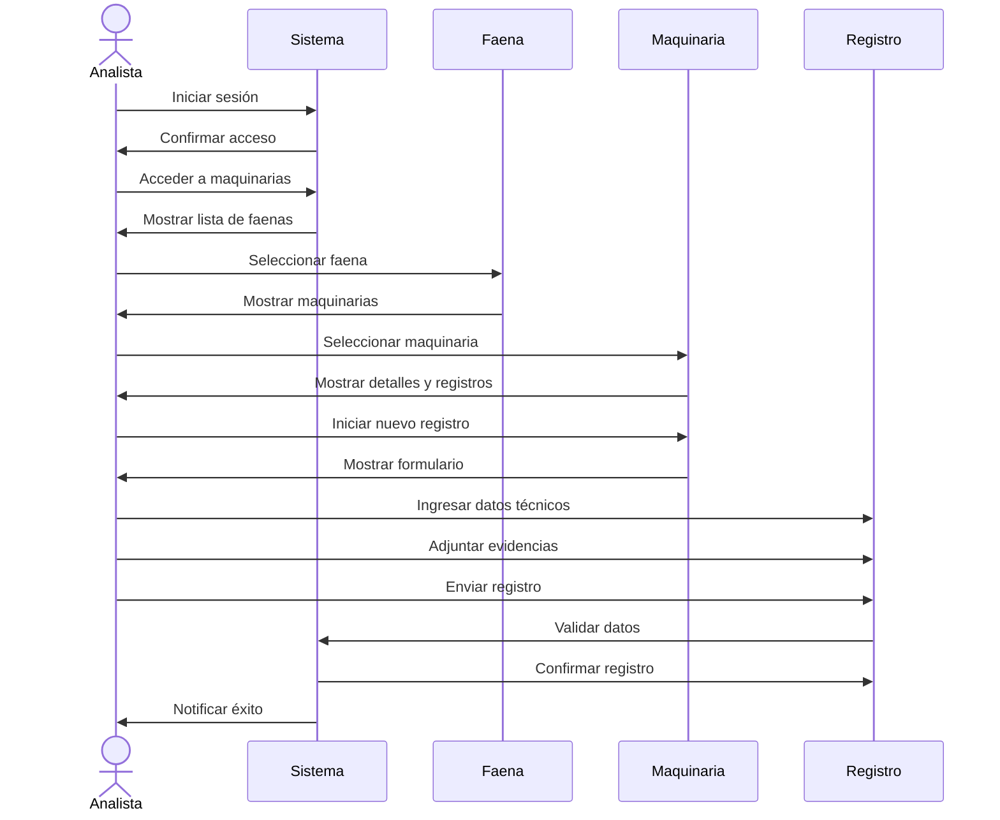
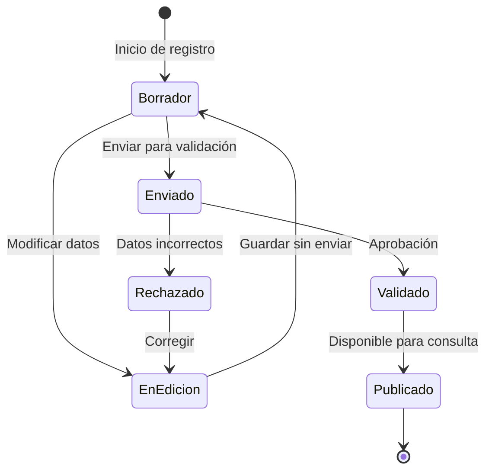
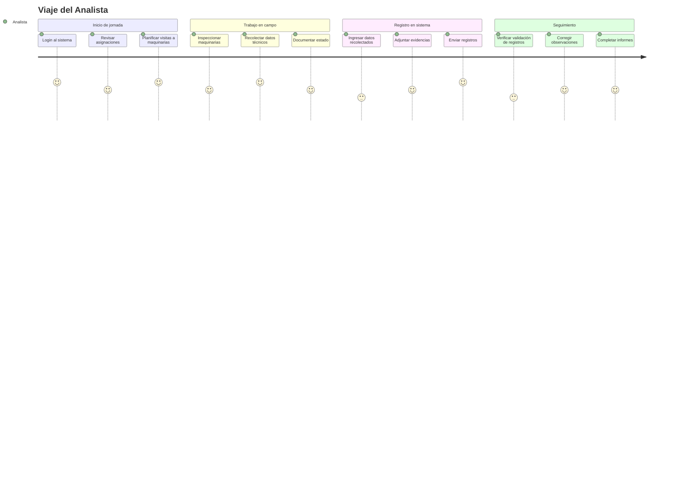

# Flujos de Usuario: Analista

Este documento presenta los diagramas que ilustran los flujos y procesos del Analista en el sistema Multotec.

## Diagrama de Flujo: Registro de Datos de Maquinaria

## Diagrama de Secuencia: Actualización de Datos Técnicos

## Diagrama de Estado: Estados de un Registro de Datos

## Diagrama de Viaje del Usuario: Analista

