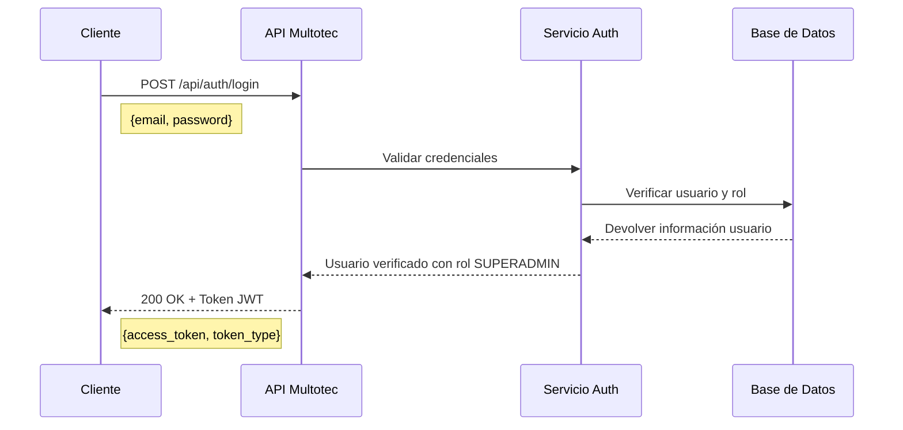
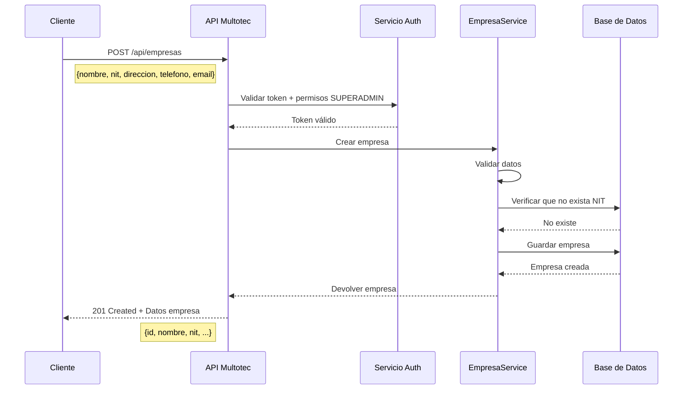
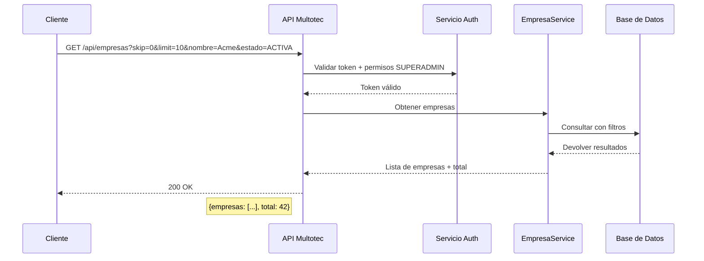
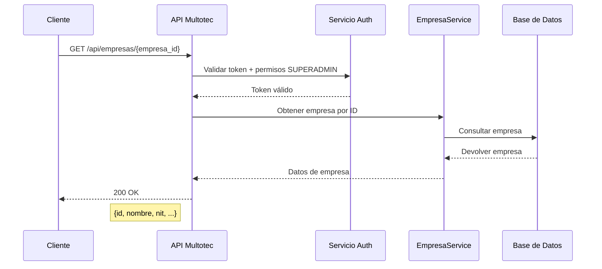
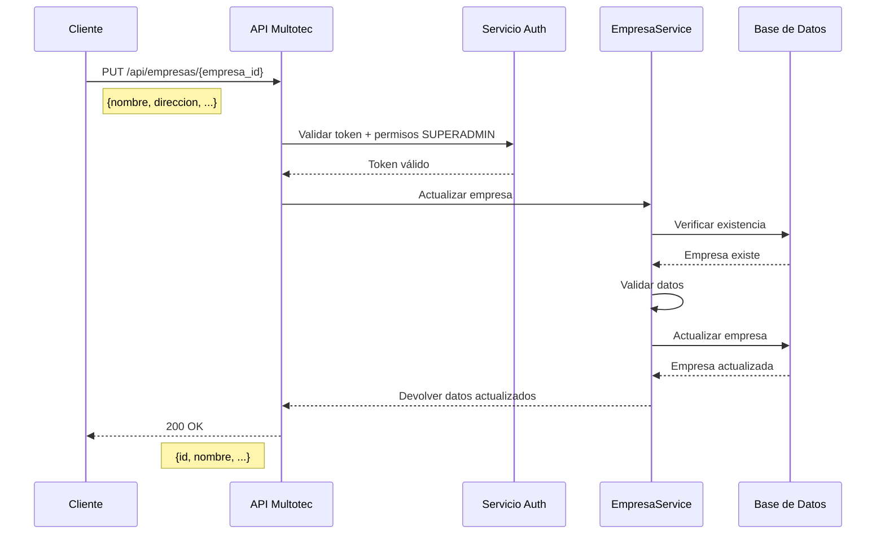
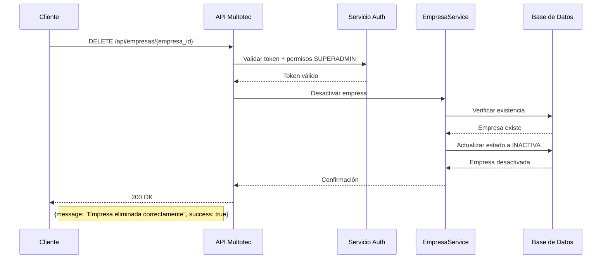
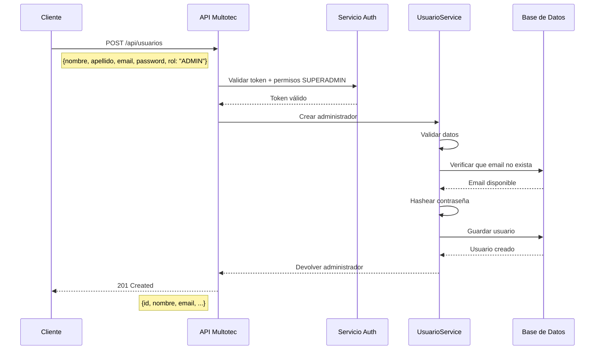
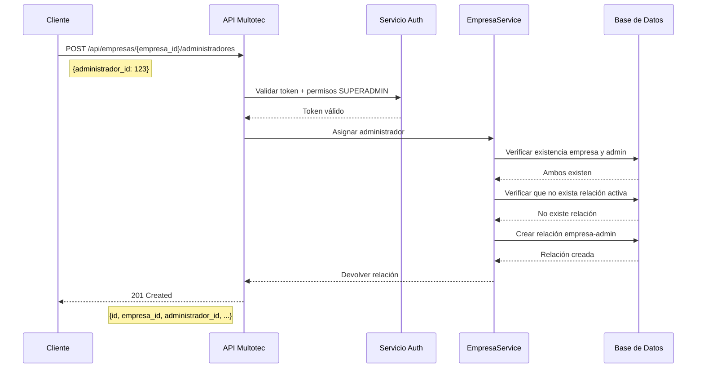
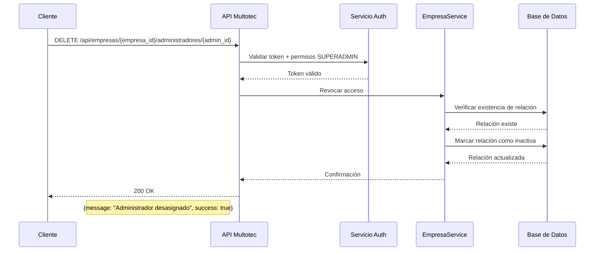
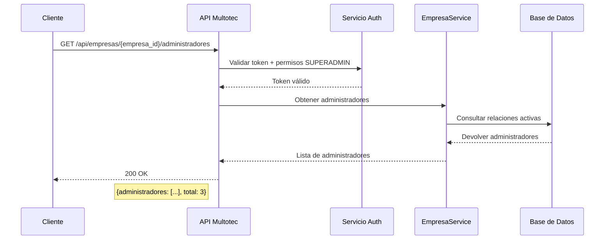

# Flujos de API para el Superadministrador

Este documento describe los principales flujos de API para las operaciones que puede realizar un superadministrador en el sistema Multotec. Se incluyen diagramas que muestran el flujo de peticiones y respuestas entre el cliente y el servidor.

## Índice

- [Flujos de API para el Superadministrador](#flujos-de-api-para-el-superadministrador)
  - [Índice](#índice)
  - [Autenticación](#autenticación)
  - [Gestión de Empresas](#gestión-de-empresas)
    - [Crear Empresa](#crear-empresa)
    - [Listar Empresas](#listar-empresas)
    - [Obtener Detalles de Empresa](#obtener-detalles-de-empresa)
    - [Actualizar Empresa](#actualizar-empresa)
    - [Desactivar Empresa](#desactivar-empresa)
  - [Gestión de Administradores](#gestión-de-administradores)
    - [Crear Administrador](#crear-administrador)
    - [Asignar Administrador a Empresa](#asignar-administrador-a-empresa)
    - [Revocar Acceso de Administrador](#revocar-acceso-de-administrador)
    - [Listar Administradores de una Empresa](#listar-administradores-de-una-empresa)
  - [Notas Importantes](#notas-importantes)

## Autenticación

El superadministrador debe autenticarse antes de poder realizar cualquier operación en el sistema.

## Gestión de Empresas

### Crear Empresa

Proceso para crear una nueva empresa en el sistema.

### Listar Empresas

Obtener un listado de empresas con paginación y filtros opcionales.

### Obtener Detalles de Empresa

Obtener información detallada de una empresa específica.

### Actualizar Empresa

Modificar la información de una empresa existente.

### Desactivar Empresa

Marcar una empresa como inactiva en el sistema.

## Gestión de Administradores

### Crear Administrador

Registrar un nuevo administrador en el sistema.

### Asignar Administrador a Empresa

Asignar un administrador existente a una empresa específica.

### Revocar Acceso de Administrador

Eliminar el acceso de un administrador a una empresa.

### Listar Administradores de una Empresa

Obtener el listado de administradores asignados a una empresa específica.

## Notas Importantes

- Todos los endpoints requieren autenticación mediante token JWT.
- Sólo usuarios con rol SUPERADMIN pueden acceder a estos endpoints.
- Las respuestas de error incluyen códigos HTTP apropiados (400, 401, 403, 404, 500) y mensajes descriptivos.
- La paginación está disponible en endpoints de listado mediante parámetros `skip` y `limit`.
- Los filtros pueden aplicarse como parámetros de consulta en los endpoints de listado. 