# Diagrama Entidad-Relación para Multotec (Alineado con Arquitectura Hexagonal)

Este diagrama representa la estructura de datos del sistema Multotec, actualizado para reflejar la implementación basada en arquitectura hexagonal, con una clara separación entre entidades de dominio y modelos de persistencia.

## Modelo Entidad-Relación (Perspectiva de Dominio)

```mermaid
erDiagram
    %% Entidades principales del dominio
    USUARIO {
        uuid id PK
        string email UK
        string password_hash
        string nombre
        string apellido
        string phone
        string country
        boolean is_active
        boolean is_verified
        datetime created_at
        datetime updated_at
        string verification_token
        datetime verification_token_expires
        string role "super_admin|admin|analista|supervisor"
        string refresh_token
        datetime refresh_token_expires
        datetime last_login
        int login_attempts
        boolean is_locked
        datetime locked_until
        string reset_password_token
        datetime reset_password_expires
    }
    
    %% Empresa según dominio de negocios
    EMPRESA {
        uuid id PK
        string nombre UK
        string rut UK
        string giro "Actividad económica"
        string direccion
        string ciudad
        string region
        string pais
        string codigo_postal
        string coordenadas_gps
        string telefono
        string email_contacto
        string sitio_web
        datetime created_at
        datetime updated_at
        boolean is_active
        string logo_url
        string descripcion
        uuid created_by FK "Usuario que creó la empresa"
    }
    
    %% Relación normalizada entre Usuario y Empresa
    EMPRESA_ADMINISTRADOR {
        uuid id PK
        uuid usuario_id FK "Administrador"
        uuid empresa_id FK "Empresa"
        boolean es_principal "Indica si es el administrador principal"
        datetime assigned_at
        uuid assigned_by FK "Usuario que asignó"
        boolean is_active
    }
    
    %% Faena según dominio de negocios
    FAENA {
        uuid id PK
        uuid empresa_id FK "Cliente"
        string nombre
        string ubicacion
        string ciudad
        string region
        string pais
        string coordenadas_gps
        string descripcion
        datetime fecha_inicio
        datetime fecha_fin
        string estado "planificada|en_preparacion|activa|en_pausa|completada|cerrada"
        datetime created_at
        datetime updated_at
        uuid created_by FK "Usuario que creó la faena"
        string codigo_interno
        int capacidad_operativa
    }
    
    %% Usuario responsables de faena - relación normalizada
    FAENA_RESPONSABLE {
        uuid id PK
        uuid faena_id FK
        uuid usuario_id FK
        string rol "responsable|colaborador|observador"
        datetime assigned_at
        boolean is_active
        uuid assigned_by FK "Usuario que asignó"
    }
    
    %% Maquinaria con relaciones normalizadas
    MAQUINARIA {
        uuid id PK
        uuid faena_id FK
        string nombre
        string codigo_etapa
        uuid etapa_proceso_id FK "Referencia a catálogo de etapas"
        uuid marca_id FK "Referencia a catálogo de marcas"
        uuid modelo_id FK "Referencia a catálogo de modelos"
        float rpm
        uuid tipo_rodamiento_id FK "Referencia a catálogo de rodamientos"
        float peso_kg
        uuid sistema_transmision_id FK "Referencia a catálogo de sistemas"
        string numero_serie UK
        string estado "operativa|mantenimiento|inactiva|en_pruebas|requiere_atencion"
        datetime ultimo_mantenimiento
        datetime proximo_mantenimiento
        uuid motor_id FK "Referencia a catálogo de motores"
        int cantidad_motores
        datetime created_at
        datetime updated_at
        uuid created_by FK
        float horas_operacion
    }
    
    %% Entidades del catálogo normalizadas
    ETAPA_PROCESO {
        uuid id PK
        string nombre UK "Ej: HARNERO TERCIARIO"
        string descripcion
        boolean activo
    }
    
    MARCA {
        uuid id PK
        string nombre UK "Ej: VIBRAMECH"
        string descripcion
        string pais_origen
        boolean activo
    }
    
    MODELO {
        uuid id PK
        uuid marca_id FK
        string nombre "Ej: H2 - 61 - 24"
        string descripcion
        string caracteristicas_json
        boolean activo
    }
    
    TIPO_RODAMIENTO {
        uuid id PK
        string nombre UK "Ej: Roller"
        string descripcion
        boolean activo
    }
    
    SISTEMA_TRANSMISION {
        uuid id PK
        string nombre UK "Ej: Directa (motor vibratorio)"
        string descripcion
        boolean activo
    }
    
    MOTOR {
        uuid id PK
        string modelo UK "Ej: KEEH 170 - 8"
        string voltaje "Ej: 380V"
        string frecuencia "Ej: 50 Hz"
        float potencia "Ej: 11 kW"
        string descripcion
        boolean activo
    }
    
    %% Registro de datos normalizado
    REGISTRO_DATOS {
        uuid id PK
        uuid maquinaria_id FK
        uuid usuario_id FK "analista que registró"
        datetime fecha_registro
        string observaciones
        string estado_operacion "normal|alerta|critico"
        datetime created_at
        json datos_tecnicos "JSON con mediciones y valores"
        boolean requiere_intervencion
        string nivel_prioridad "baja|media|alta|critica"
    }
    
    %% Evidencias normalizadas
    EVIDENCIA {
        uuid id PK
        uuid registro_id FK
        string tipo "imagen|video|documento|audio"
        string url
        string nombre_archivo
        string descripcion
        datetime created_at
        uuid created_by FK
    }
    
    %% Tablas adicionales normalizadas
    ALERTA {
        uuid id PK
        uuid maquinaria_id FK
        uuid registro_id FK "Registro que generó la alerta"
        uuid creador_id FK "Usuario que creó la alerta"
        string tipo "mantenimiento|falla|operacion"
        string descripcion
        string nivel "informativa|advertencia|critica"
        boolean resuelta
        datetime fecha_creacion
        datetime fecha_resolucion
        uuid resuelto_por FK "Usuario que resolvió"
        string acciones_tomadas
    }
    
    MANTENIMIENTO {
        uuid id PK
        uuid maquinaria_id FK
        uuid tipo_mantenimiento_id FK "Referencia a catálogo"
        string descripcion
        datetime fecha_programada
        datetime fecha_realizacion
        uuid responsable_id FK "Usuario responsable"
        uuid realizado_por FK "Usuario que realizó"
        string estado "programado|en_proceso|completado|cancelado"
        string observaciones
        float costo
        int horas_trabajo
    }
    
    REPUESTO_MANTENIMIENTO {
        uuid id PK
        uuid mantenimiento_id FK
        uuid repuesto_id FK
        int cantidad
        float costo_unitario
    }
    
    REPUESTO {
        uuid id PK
        string codigo UK
        string nombre
        string descripcion
        float costo_referencia
        string unidad_medida
        int stock_minimo
        int stock_actual
        boolean activo
    }
    
    DOCUMENTO {
        uuid id PK
        string nombre
        string descripcion
        string url
        uuid tipo_documento_id FK
        datetime fecha_subida
        uuid subido_por FK
        int tamano_bytes
        string formato
        uuid entidad_id "ID de la entidad relacionada"
        string tipo_entidad "empresa|faena|maquinaria|mantenimiento"
    }
    
    TIPO_DOCUMENTO {
        uuid id PK
        string nombre UK "manual|certificado|informe|otro"
        string descripcion
        boolean activo
    }
    
    NOTIFICACION {
        uuid id PK
        uuid usuario_id FK "Destinatario"
        string titulo
        string mensaje
        boolean leida
        datetime fecha_creacion
        datetime fecha_lectura
        string tipo "alerta|asignacion|sistema|mantenimiento"
        string url_accion
        uuid entidad_id "ID de la entidad relacionada"
        string tipo_entidad "empresa|faena|maquinaria|registro|alerta"
    }
    
    AUDITORIA {
        uuid id PK
        uuid usuario_id FK "Usuario que realizó la acción"
        string accion "crear|actualizar|eliminar|login|logout"
        string entidad "usuario|empresa|faena|maquinaria|registro"
        uuid entidad_id "ID de la entidad afectada"
        json datos_previos
        json datos_nuevos
        datetime fecha
        string ip_address
        string user_agent
    }
    
    CONFIGURACION_SISTEMA {
        uuid id PK
        string clave UK
        string valor
        string descripcion
        boolean es_global
        uuid entidad_id "ID de la entidad si no es global"
        string tipo_entidad "empresa|faena"
        datetime ultima_actualizacion
        uuid actualizado_por FK
    }
    
    %% Relaciones
    USUARIO ||--o{ EMPRESA_ADMINISTRADOR : "administra"
    EMPRESA ||--o{ EMPRESA_ADMINISTRADOR : "tiene administradores"
    
    USUARIO ||--o{ FAENA_RESPONSABLE : "asignado"
    FAENA ||--o{ FAENA_RESPONSABLE : "tiene responsables"
    
    EMPRESA ||--o{ FAENA : "cliente de"
    
    FAENA ||--o{ MAQUINARIA : "tiene"
    MAQUINARIA ||--o{ REGISTRO_DATOS : "tiene"
    USUARIO ||--o{ REGISTRO_DATOS : "registra"
    
    REGISTRO_DATOS ||--o{ EVIDENCIA : "tiene"
    
    MARCA ||--o{ MODELO : "tiene"
    MAQUINARIA }o--|| ETAPA_PROCESO : "pertenece"
    MAQUINARIA }o--|| MARCA : "es de"
    MAQUINARIA }o--|| MODELO : "es modelo"
    MAQUINARIA }o--|| TIPO_RODAMIENTO : "usa"
    MAQUINARIA }o--|| SISTEMA_TRANSMISION : "usa"
    MAQUINARIA }o--|| MOTOR : "equipado con"
    
    MAQUINARIA ||--o{ ALERTA : "genera"
    REGISTRO_DATOS ||--o{ ALERTA : "puede generar"
    USUARIO ||--o{ ALERTA : "crea y resuelve"
    
    MAQUINARIA ||--o{ MANTENIMIENTO : "requiere"
    USUARIO ||--o{ MANTENIMIENTO : "responsable y realiza"
    
    MANTENIMIENTO ||--o{ REPUESTO_MANTENIMIENTO : "utiliza"
    REPUESTO ||--o{ REPUESTO_MANTENIMIENTO : "usado en"
    
    DOCUMENTO }o--|| TIPO_DOCUMENTO : "es de tipo"
    USUARIO ||--o{ DOCUMENTO : "sube"
    
    USUARIO ||--o{ NOTIFICACION : "recibe"
    USUARIO ||--o{ AUDITORIA : "genera"
    USUARIO ||--o{ CONFIGURACION_SISTEMA : "actualiza"
```

## Implementación en Arquitectura Hexagonal

La implementación del modelo sigue los principios de la arquitectura hexagonal:

1. **Capa de Dominio**: Define entidades puras y reglas de negocio
   - Entidades: `Empresa`, `Usuario`, `Faena`, `Maquinaria`, etc.
   - Interfaces de repositorio (puertos): `EmpresaRepositoryInterface`, `UsuarioRepositoryInterface`, etc.

2. **Capa de Aplicación**: Orquesta los casos de uso
   - DTOs para transferencia de datos (`EmpresaDTO`, etc.)
   - Casos de uso específicos para operaciones CRUD

3. **Capa de Infraestructura**: Implementa adaptadores para persistencia y API
   - Modelos ORM: `EmpresaModel`, `UsuarioModel`, etc.
   - Adaptadores de repositorio: `SQLAlchemyEmpresaRepository`, etc.
   - Controladores API y esquemas de validación

## Propiedades clave del modelo

1. **Normalización**: Aplicación de la Tercera Forma Normal (3NF)
   - Eliminación de dependencias transitivas
   - Cada atributo depende de la clave (1NF)
   - Cada atributo no clave depende de toda la clave (2NF)
   - Cada atributo no clave depende directamente de la clave (3NF)

2. **Integridad Referencial**:
   - Uso de claves foráneas para garantizar relaciones válidas
   - Soporte para restricciones de integridad en la base de datos

3. **Trazabilidad y Auditoría**:
   - Registro de creación y modificación en todas las entidades
   - Tabla de auditoría para cambios importantes

4. **Soporta Todos los Flujos**:
   - Gestión completa de empresas y administradores por el Superadministrador
   - Gestión de faenas y maquinaria por Administradores
   - Registro de datos por Analistas
   - Monitoreo y reportes por Supervisores
