# Flujos de Usuario en Multotec

Este documento presenta los diagramas de flujo para los diferentes roles de usuario en el sistema Multotec, utilizando MermaidJS para visualizar los procesos e interacciones.

## Índice

1. [Superadministrador](#superadministrador)
2. [Administrador](#administrador)
3. [Analista](#analista)
4. [Supervisor](#supervisor)

## Superadministrador

### Diagrama de Flujo: Creación de Empresa

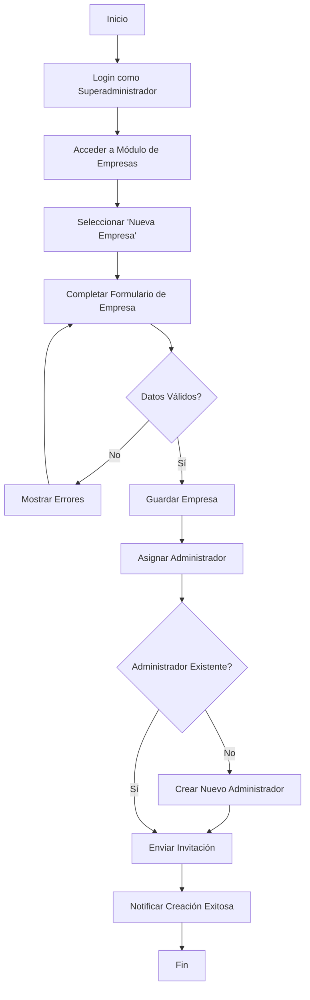

### Diagrama de Secuencia: Asignación de Administrador a Empresa

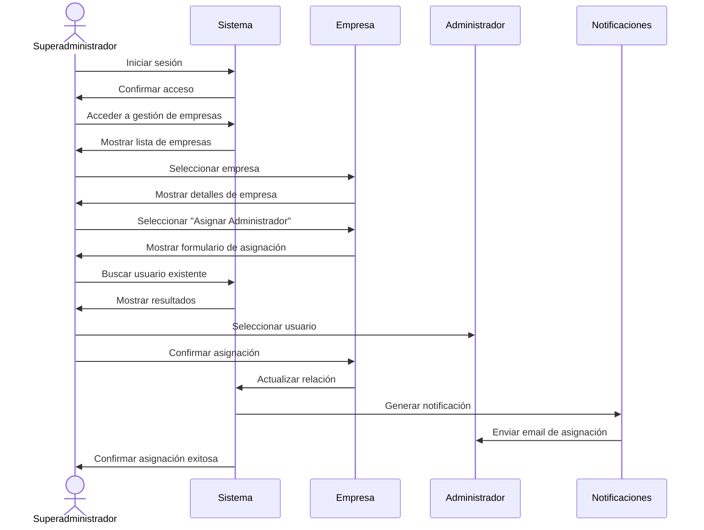

### Diagrama de Estado: Ciclo de Vida de una Empresa

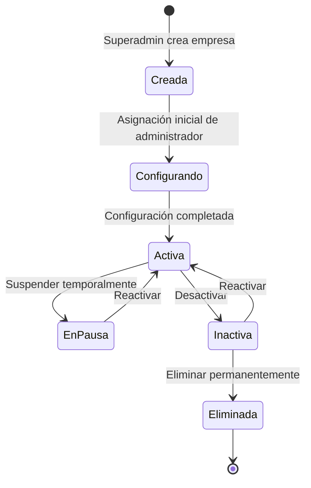

### Diagrama de Caso de Uso: Viaje del Superadministrador

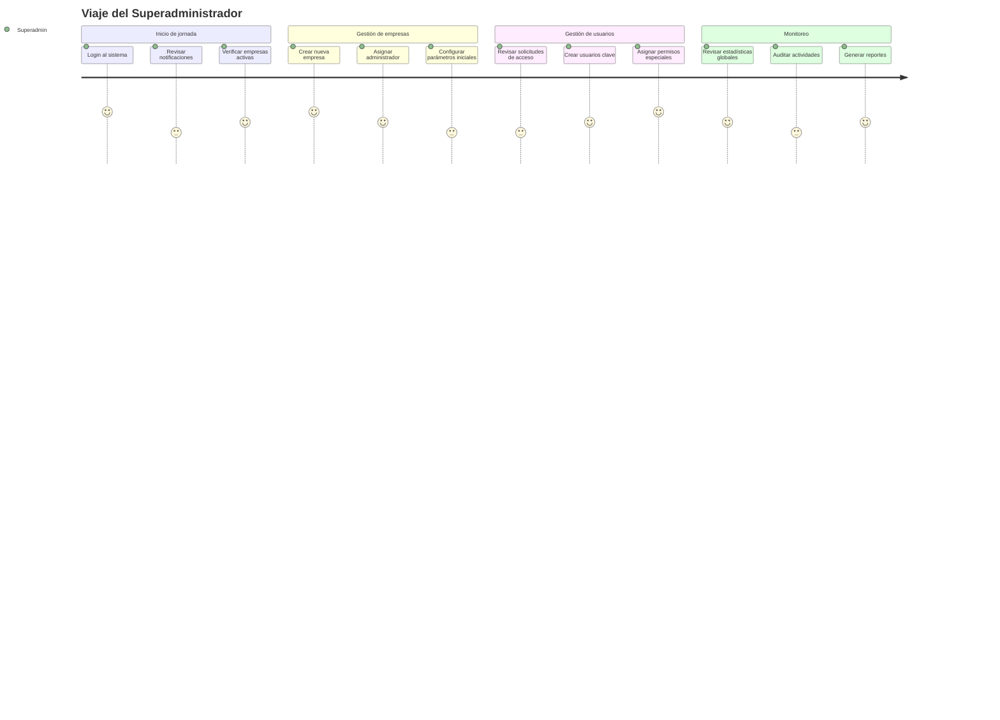

## Administrador

### Diagrama de Flujo: Gestión de Usuarios de Empresa

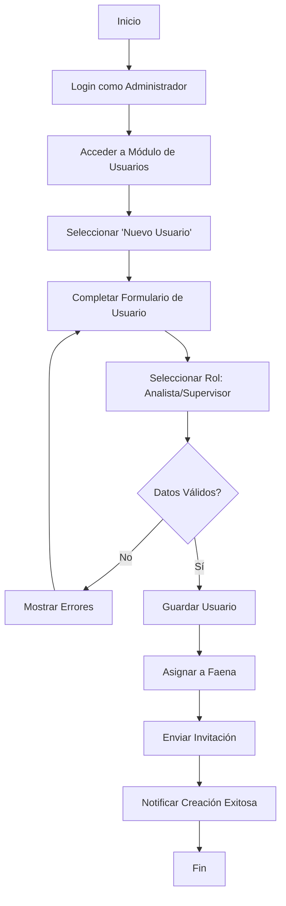

### Diagrama de Secuencia: Creación de Faena

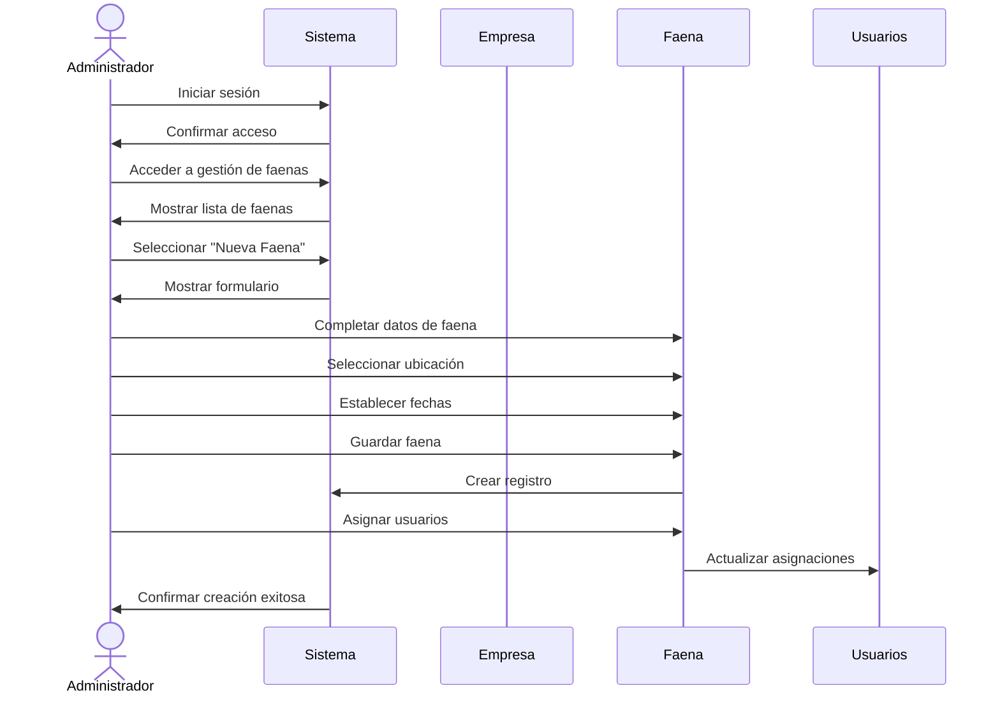

### Diagrama de Estado: Ciclo de Vida de una Faena

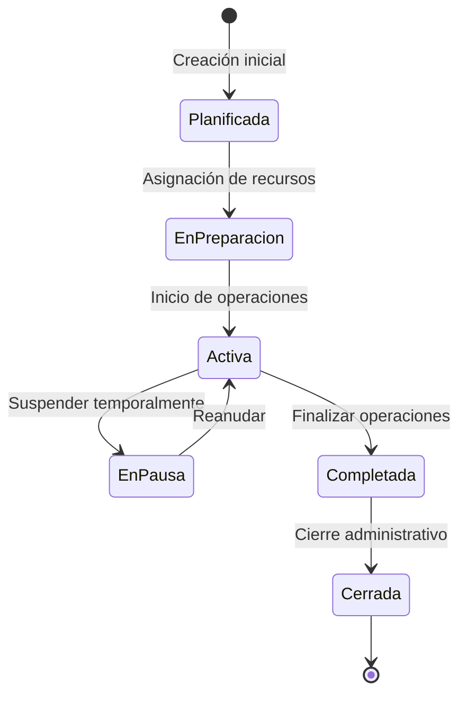

### Diagrama de Caso de Uso: Viaje del Administrador

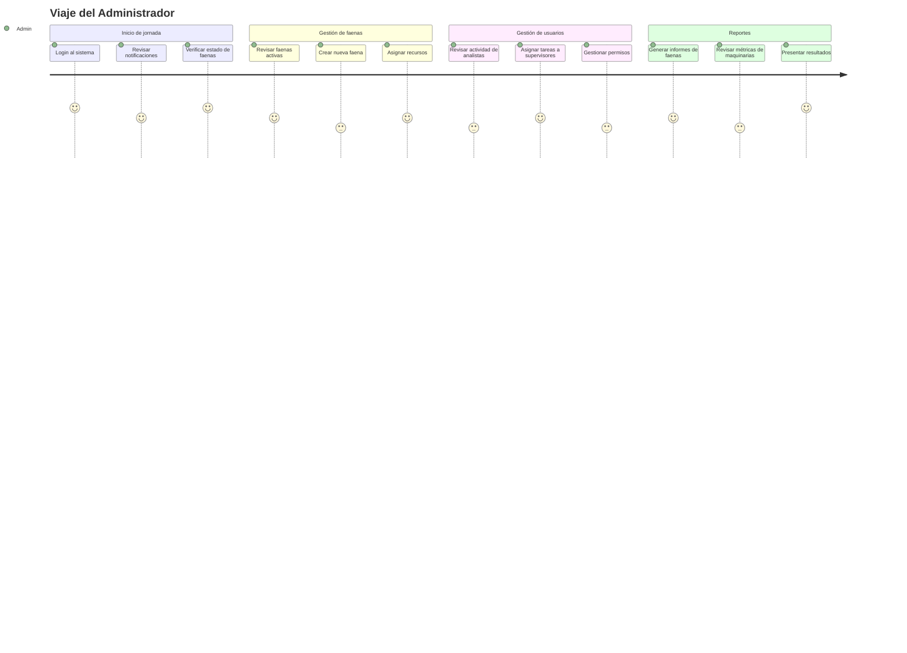

## Analista

### Diagrama de Flujo: Registro de Datos de Maquinaria

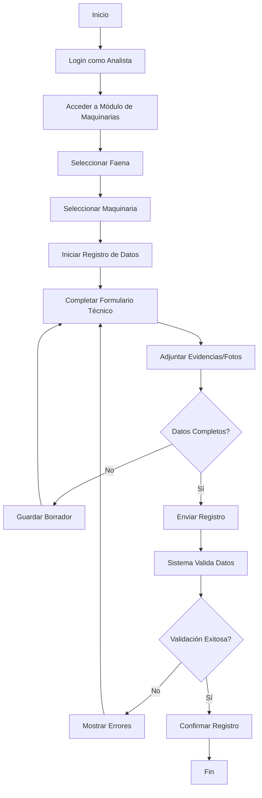

### Diagrama de Secuencia: Actualización de Datos Técnicos

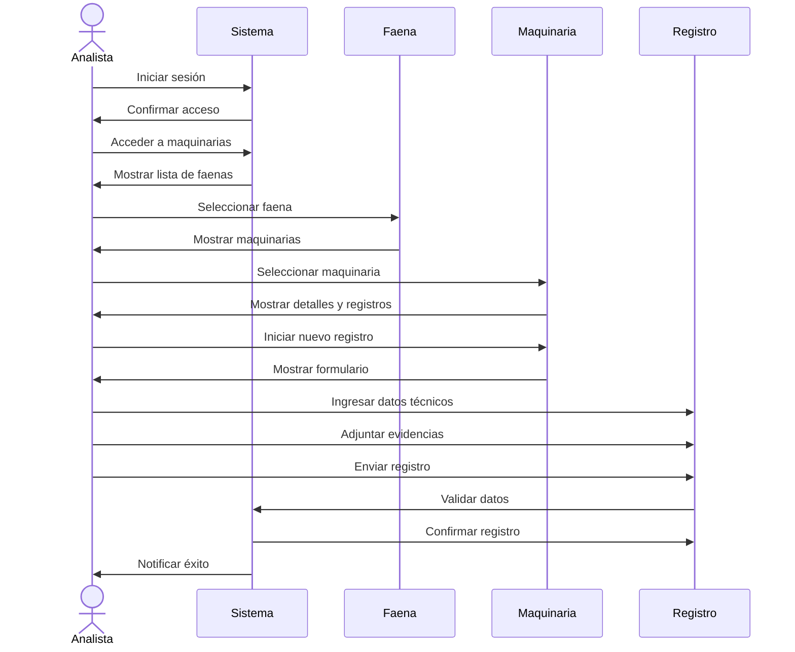

### Diagrama de Estado: Estados de un Registro de Datos

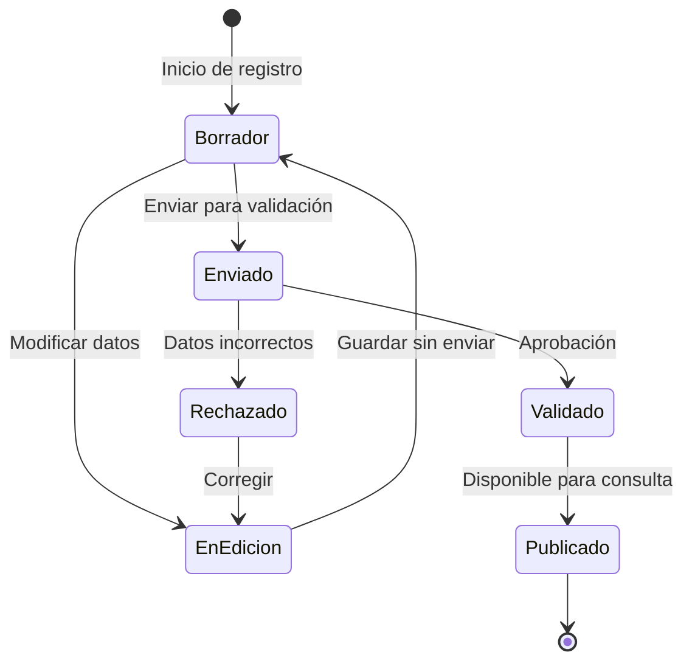

### Diagrama de Caso de Uso: Viaje del Analista

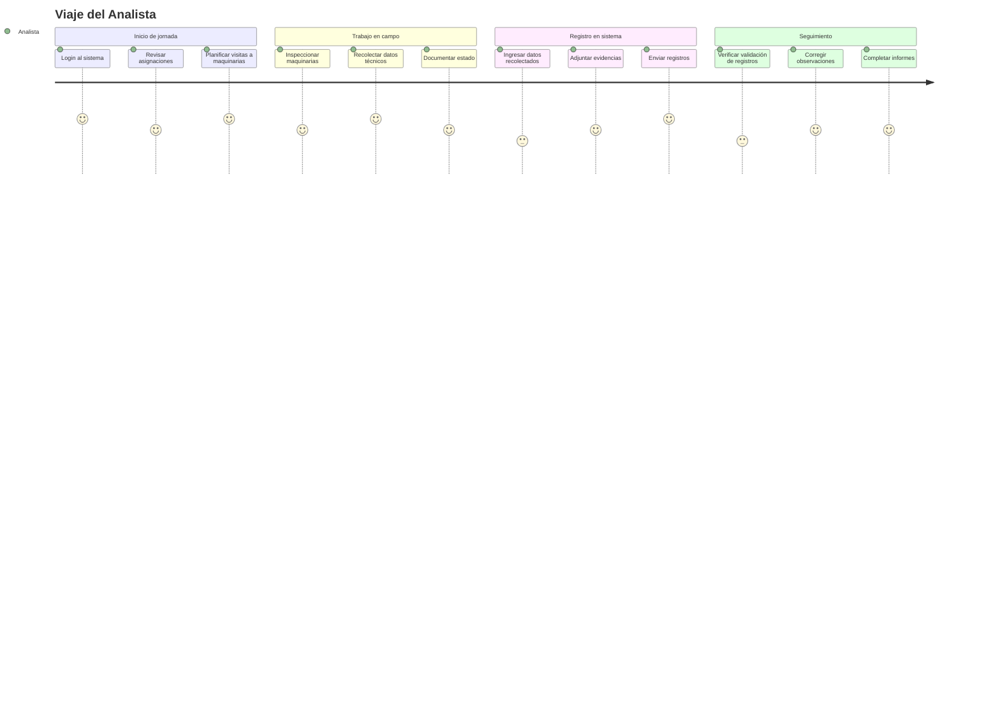

## Supervisor

### Diagrama de Flujo: Monitoreo de Maquinarias

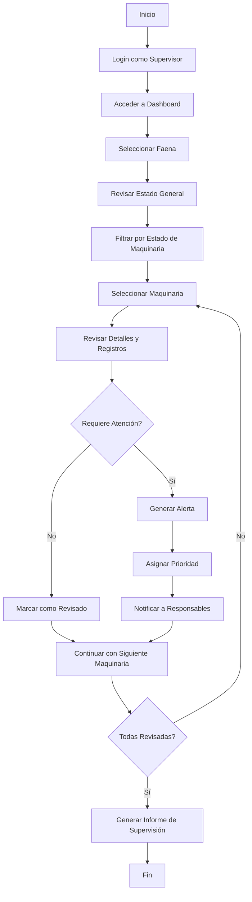

### Diagrama de Secuencia: Consulta de Informes

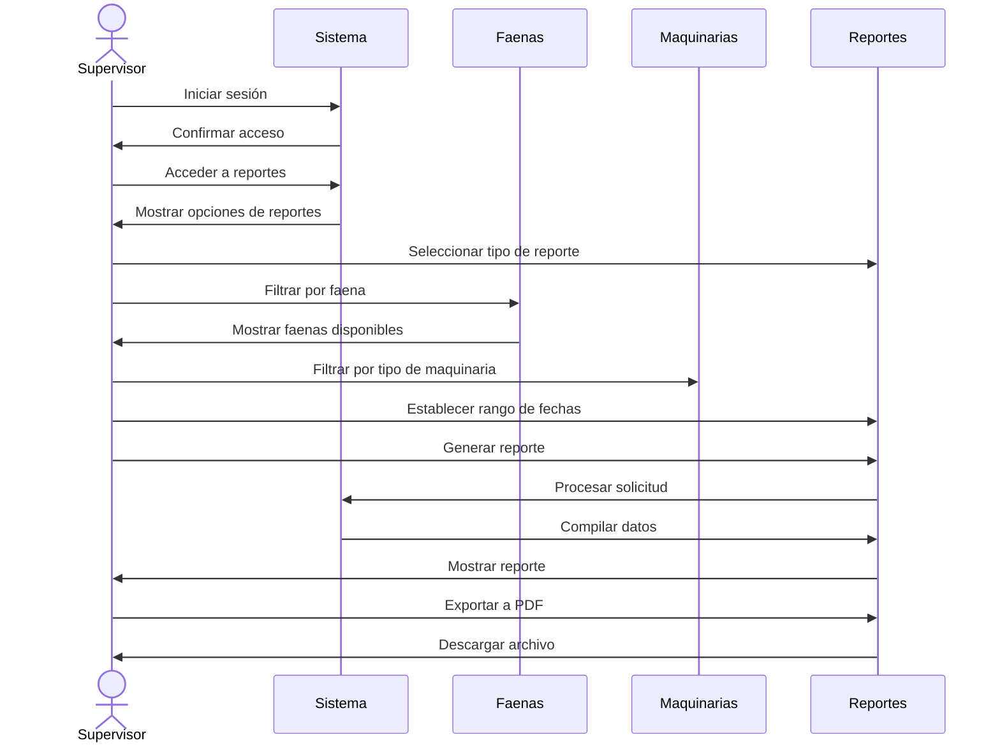

### Diagrama de Estado: Monitoreo de Estados de Maquinarias

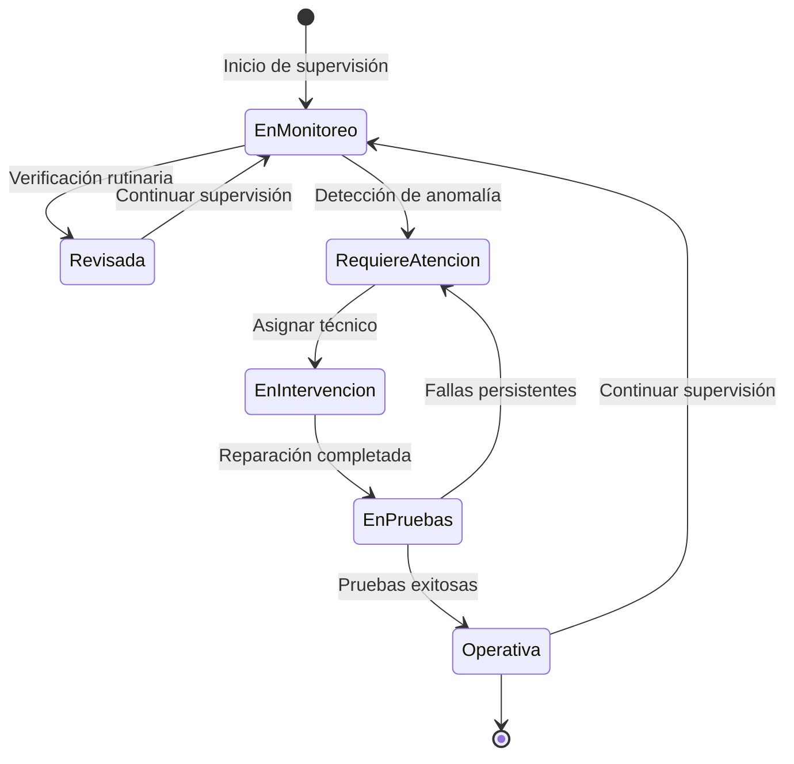

### Diagrama de Caso de Uso: Viaje del Supervisor

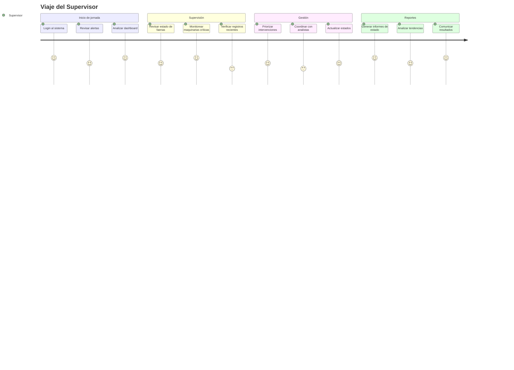