# Proyecto Multotec: Documentación Completa

## Resumen Ejecutivo

El sistema Multotec es una plataforma integral para la gestión de maquinaria industrial, diseñada para optimizar el monitoreo, mantenimiento y operación de equipos en faenas mineras. La plataforma permite la colaboración entre diferentes roles (Superadministrador, Administrador, Supervisor y Analista) para mantener un registro actualizado del estado y rendimiento de las maquinarias.

Esta documentación presenta el modelo de datos del sistema y los flujos de trabajo de cada rol de usuario, ilustrados mediante diferentes tipos de diagramas que facilitan la comprensión del funcionamiento integral del sistema.

## Índice de Contenidos

1. [Modelo de Datos](#modelo-de-datos)
2. [Rol: Superadministrador](#rol-superadministrador)
3. [Rol: Administrador](#rol-administrador)
4. [Rol: Analista](#rol-analista)
5. [Rol: Supervisor](#rol-supervisor)
6. [Consideraciones de Implementación](#consideraciones-de-implementación)

---

## Modelo de Datos

El modelo de datos de Multotec ha sido diseñado siguiendo los principios de la arquitectura hexagonal y aplicando la Tercera Forma Normal (3NF) para garantizar integridad, escalabilidad y mantenibilidad.

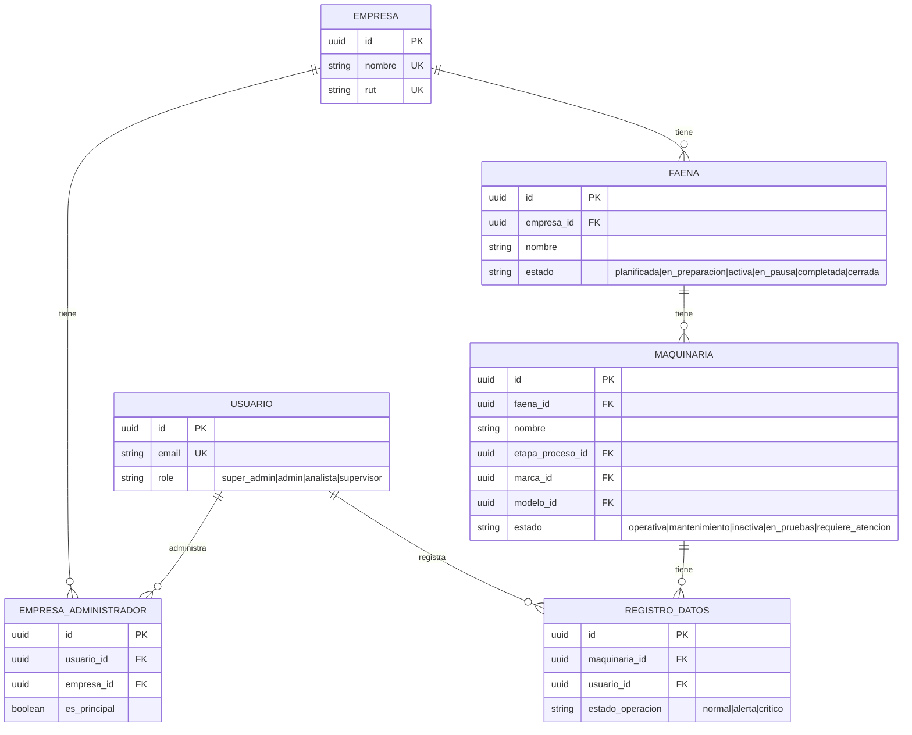
```mermaid
erDiagram
    %% Entidades principales resumidas para esta presentación
    USUARIO {
        uuid id PK
        string email UK
        string role "super_admin|admin|analista|supervisor"
    }
    
    EMPRESA {
        uuid id PK
        string nombre UK
        string rut UK
    }
    
    EMPRESA_ADMINISTRADOR {
        uuid id PK
        uuid usuario_id FK
        uuid empresa_id FK
        boolean es_principal
    }
    
    FAENA {
        uuid id PK
        uuid empresa_id FK
        string nombre
        string estado "planificada|en_preparacion|activa|en_pausa|completada|cerrada"
    }
    
    MAQUINARIA {
        uuid id PK
        uuid faena_id FK
        string nombre
        uuid etapa_proceso_id FK
        uuid marca_id FK
        uuid modelo_id FK
        string estado "operativa|mantenimiento|inactiva|en_pruebas|requiere_atencion"
    }
    
    REGISTRO_DATOS {
        uuid id PK
        uuid maquinaria_id FK
        uuid usuario_id FK
        string estado_operacion "normal|alerta|critico"
    }
    
    %% Relaciones principales
    USUARIO ||--o{ EMPRESA_ADMINISTRADOR : "administra"
    EMPRESA ||--o{ EMPRESA_ADMINISTRADOR : "tiene"
    EMPRESA ||--o{ FAENA : "tiene"
    FAENA ||--o{ MAQUINARIA : "tiene"
    MAQUINARIA ||--o{ REGISTRO_DATOS : "tiene"
    USUARIO ||--o{ REGISTRO_DATOS : "registra"
```

El modelo completo incluye entidades normalizadas para catálogos, relaciones y funcionalidades adicionales, siguiendo estrictamente la arquitectura hexagonal. Para más detalles, consulte el documento [entidad-relacion.md](entidad-relacion.md).

---

## Rol: Superadministrador

El Superadministrador es responsable de la administración global del sistema, gestionando empresas y administradores. Sus funciones principales incluyen:

### Funcionalidades del Superadministrador

1. **Gestión de Empresas (CRUD)**
   - Crear empresas nuevas con datos básicos (nombre, dirección, teléfono)
   - Visualizar listado de todas las empresas en el sistema
   - Actualizar información de empresas existentes
   - Desactivar o eliminar empresas según sea necesario

2. **Gestión de Administradores (CRUD)**
   - Crear cuentas de usuario con rol de administrador
   - Visualizar y buscar administradores existentes
   - Modificar información de administradores
   - Desactivar cuentas de administrador

3. **Asociación Empresa-Administrador**
   - Asignar uno o más administradores a cada empresa
   - Designar un administrador principal responsable
   - Modificar asignaciones existentes
   - Revocar permisos de administradores sobre empresas

### Estructura de datos básicos

- **Empresa**
  ```json
  {
    "id": "uuid",
    "nombre": "string", 
    "direccion": "string",
    "telefono": "string",
    "administrador_responsable_id": "uuid",
    "is_active": "boolean",
    "created_at": "datetime"
  }
  ```

- **Administrador** (Usuario con rol "admin")
  ```json
  {
    "id": "uuid",
    "email": "string",
    "nombre": "string",
    "apellido": "string",
    "telefono": "string",
    "role": "admin",
    "is_active": "boolean"
  }
  ```

- **Asociación Administrador-Empresa**
  ```json
  {
    "id": "uuid",
    "administrador_id": "uuid",
    "empresa_id": "uuid",
    "es_principal": "boolean",
    "created_at": "datetime"
  }
  ```

### Diagrama de Flujo: Gestión de Empresas

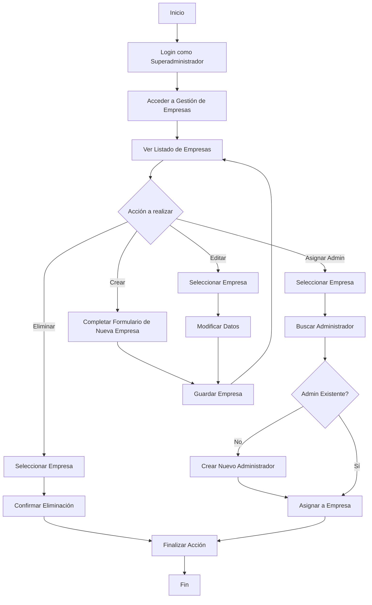
```mermaid
flowchart TD
    A[Inicio] --> B[Login como Superadministrador]
    B --> C[Acceder a Gestión de Empresas]
    C --> D[Ver Listado de Empresas]
    D --> E{Acción a realizar}
    E -->|Crear| F[Completar Formulario de Nueva Empresa]
    E -->|Editar| G[Seleccionar Empresa]
    G --> H[Modificar Datos]
    E -->|Eliminar| I[Seleccionar Empresa]
    I --> J[Confirmar Eliminación]
    E -->|Asignar Admin| K[Seleccionar Empresa]
    K --> L[Buscar Administrador]
    L --> M{Admin Existente?}
    M -->|No| N[Crear Nuevo Administrador]
    N --> O[Asignar a Empresa]
    M -->|Sí| O
    F --> P[Guardar Empresa]
    H --> P
    J --> Q[Finalizar Acción]
    O --> Q
    P --> D
    Q --> R[Fin]
```

### Diagrama de Secuencia: Creación de Empresa y Asignación de Administrador

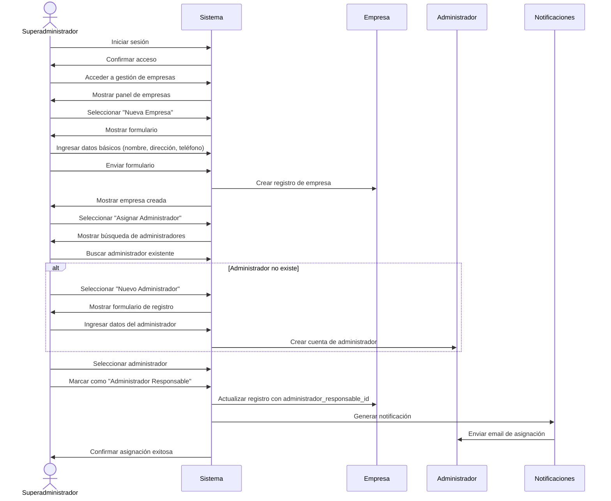
```mermaid
sequenceDiagram
    actor SA as Superadministrador
    participant S as Sistema
    participant E as Empresa
    participant A as Administrador
    participant N as Notificaciones
    
    SA->>S: Iniciar sesión
    S->>SA: Confirmar acceso
    SA->>S: Acceder a gestión de empresas
    S->>SA: Mostrar panel de empresas
    SA->>S: Seleccionar "Nueva Empresa"
    S->>SA: Mostrar formulario
    SA->>S: Ingresar datos básicos (nombre, dirección, teléfono)
    SA->>S: Enviar formulario
    S->>E: Crear registro de empresa
    S->>SA: Mostrar empresa creada
    SA->>S: Seleccionar "Asignar Administrador"
    S->>SA: Mostrar búsqueda de administradores
    SA->>S: Buscar administrador existente
    alt Administrador no existe
        SA->>S: Seleccionar "Nuevo Administrador"
        S->>SA: Mostrar formulario de registro
        SA->>S: Ingresar datos del administrador
        S->>A: Crear cuenta de administrador
    end
    SA->>S: Seleccionar administrador
    SA->>S: Marcar como "Administrador Responsable"
    S->>E: Actualizar registro con administrador_responsable_id
    S->>N: Generar notificación
    N->>A: Enviar email de asignación
    S->>SA: Confirmar asignación exitosa
```

### Diagrama de Estado: Ciclo de Vida de una Empresa

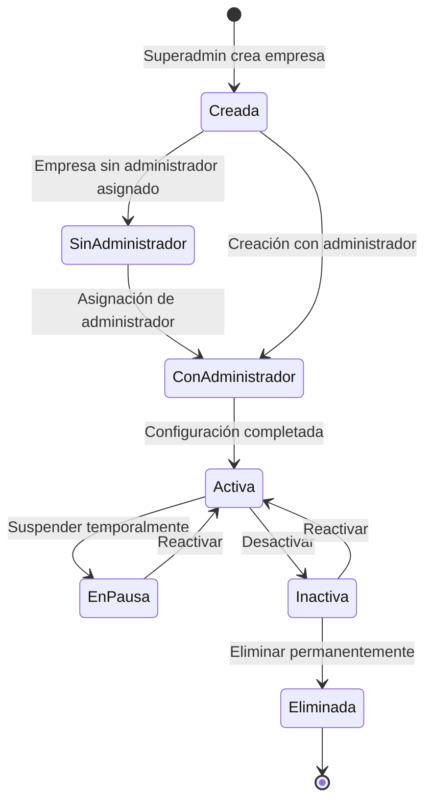
```mermaid
stateDiagram-v2
    [*] --> Creada: Superadmin crea empresa
    Creada --> SinAdministrador: Empresa sin administrador asignado
    SinAdministrador --> ConAdministrador: Asignación de administrador
    Creada --> ConAdministrador: Creación con administrador
    ConAdministrador --> Activa: Configuración completada
    Activa --> EnPausa: Suspender temporalmente
    EnPausa --> Activa: Reactivar
    Activa --> Inactiva: Desactivar
    Inactiva --> Activa: Reactivar
    Inactiva --> Eliminada: Eliminar permanentemente
    Eliminada --> [*]
```

### Diagrama de Viaje del Usuario: Superadministrador

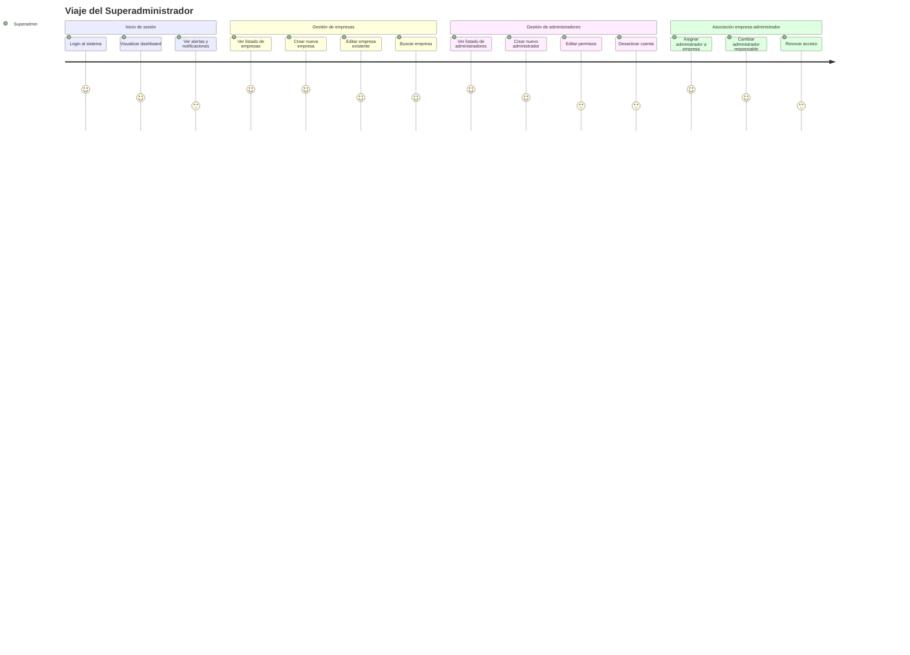
```mermaid
journey
    title Viaje del Superadministrador
    section Inicio de sesión
      Login al sistema: 5: Superadmin
      Visualizar dashboard: 4: Superadmin
      Ver alertas y notificaciones: 3: Superadmin
    section Gestión de empresas
      Ver listado de empresas: 5: Superadmin
      Crear nueva empresa: 5: Superadmin
      Editar empresa existente: 4: Superadmin
      Buscar empresa: 4: Superadmin
    section Gestión de administradores
      Ver listado de administradores: 5: Superadmin
      Crear nuevo administrador: 4: Superadmin
      Editar permisos: 3: Superadmin
      Desactivar cuenta: 3: Superadmin
    section Asociación empresa-administrador
      Asignar administrador a empresa: 5: Superadmin
      Cambiar administrador responsable: 4: Superadmin
      Revocar acceso: 3: Superadmin
```

---

## Rol: Administrador

El Administrador es responsable de gestionar una empresa específica, incluyendo la creación y administración de faenas, maquinarias y usuarios internos.

### Diagrama de Flujo: Gestión de Usuarios de Empresa

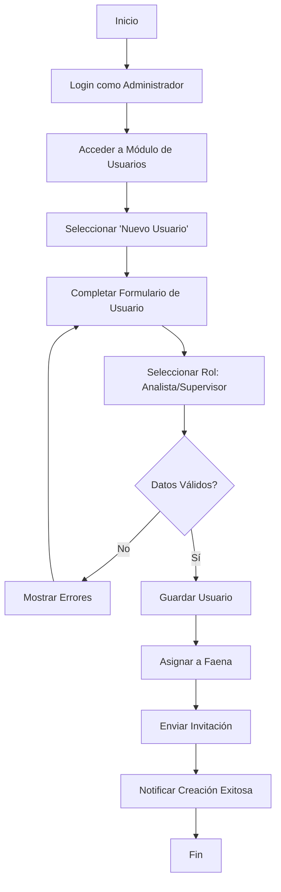
```mermaid
flowchart TD
    A[Inicio] --> B[Login como Administrador]
    B --> C[Acceder a Módulo de Usuarios]
    C --> D[Seleccionar 'Nuevo Usuario']
    D --> E[Completar Formulario de Usuario]
    E --> F[Seleccionar Rol: Analista/Supervisor]
    F --> G{Datos Válidos?}
    G -->|No| H[Mostrar Errores]
    H --> E
    G -->|Sí| I[Guardar Usuario]
    I --> J[Asignar a Faena]
    J --> K[Enviar Invitación]
    K --> L[Notificar Creación Exitosa]
    L --> M[Fin]
```

### Diagrama de Secuencia: Creación de Faena

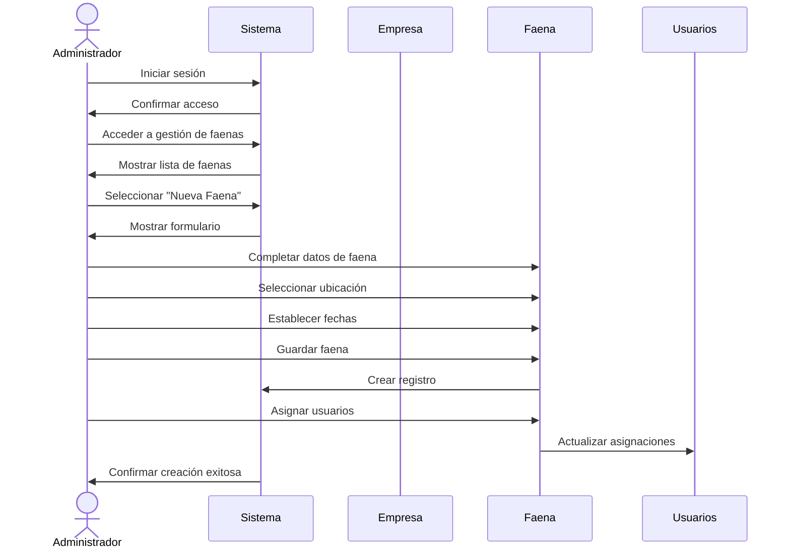
```mermaid
sequenceDiagram
    actor A as Administrador
    participant S as Sistema
    participant E as Empresa
    participant F as Faena
    participant U as Usuarios
    
    A->>S: Iniciar sesión
    S->>A: Confirmar acceso
    A->>S: Acceder a gestión de faenas
    S->>A: Mostrar lista de faenas
    A->>S: Seleccionar "Nueva Faena"
    S->>A: Mostrar formulario
    A->>F: Completar datos de faena
    A->>F: Seleccionar ubicación
    A->>F: Establecer fechas
    A->>F: Guardar faena
    F->>S: Crear registro
    A->>F: Asignar usuarios
    F->>U: Actualizar asignaciones
    S->>A: Confirmar creación exitosa
```

### Diagrama de Estado: Ciclo de Vida de una Faena

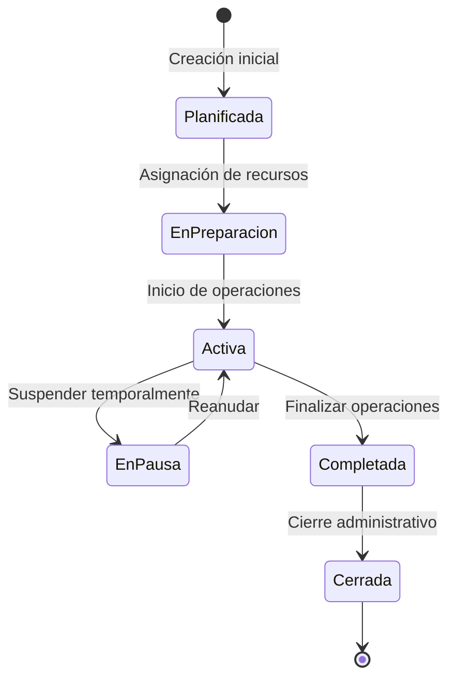
```mermaid
stateDiagram-v2
    [*] --> Planificada: Creación inicial
    Planificada --> EnPreparacion: Asignación de recursos
    EnPreparacion --> Activa: Inicio de operaciones
    Activa --> EnPausa: Suspender temporalmente
    EnPausa --> Activa: Reanudar
    Activa --> Completada: Finalizar operaciones
    Completada --> Cerrada: Cierre administrativo
    Cerrada --> [*]
```

### Diagrama de Viaje del Usuario: Administrador

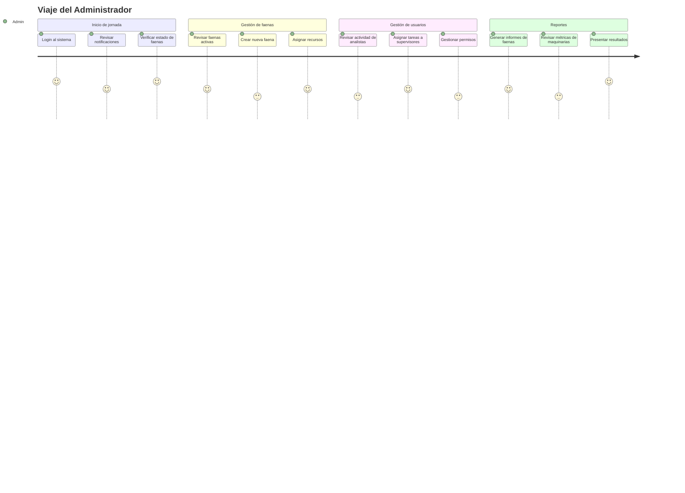
```mermaid
journey
    title Viaje del Administrador
    section Inicio de jornada
      Login al sistema: 5: Admin
      Revisar notificaciones: 4: Admin
      Verificar estado de faenas: 5: Admin
    section Gestión de faenas
      Revisar faenas activas: 4: Admin
      Crear nueva faena: 3: Admin
      Asignar recursos: 4: Admin
    section Gestión de usuarios
      Revisar actividad de analistas: 3: Admin
      Asignar tareas a supervisores: 4: Admin
      Gestionar permisos: 3: Admin
    section Reportes
      Generar informes de faenas: 4: Admin
      Revisar métricas de maquinarias: 3: Admin
      Presentar resultados: 5: Admin
```

---

## Rol: Analista

El Analista es responsable de recolectar y registrar datos técnicos de las maquinarias en terreno, incluyendo mediciones, observaciones y evidencias visuales.

### Diagrama de Flujo: Registro de Datos de Maquinaria

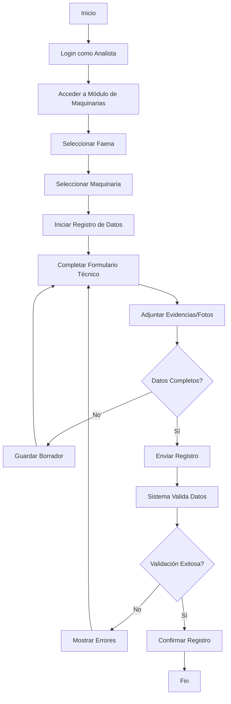
```mermaid
flowchart TD
    A[Inicio] --> B[Login como Analista]
    B --> C[Acceder a Módulo de Maquinarias]
    C --> D[Seleccionar Faena]
    D --> E[Seleccionar Maquinaria]
    E --> F[Iniciar Registro de Datos]
    F --> G[Completar Formulario Técnico]
    G --> H[Adjuntar Evidencias/Fotos]
    H --> I{Datos Completos?}
    I -->|No| J[Guardar Borrador]
    J --> G
    I -->|Sí| K[Enviar Registro]
    K --> L[Sistema Valida Datos]
    L --> M{Validación Exitosa?}
    M -->|No| N[Mostrar Errores]
    N --> G
    M -->|Sí| O[Confirmar Registro]
    O --> P[Fin]
```

### Diagrama de Secuencia: Actualización de Datos Técnicos

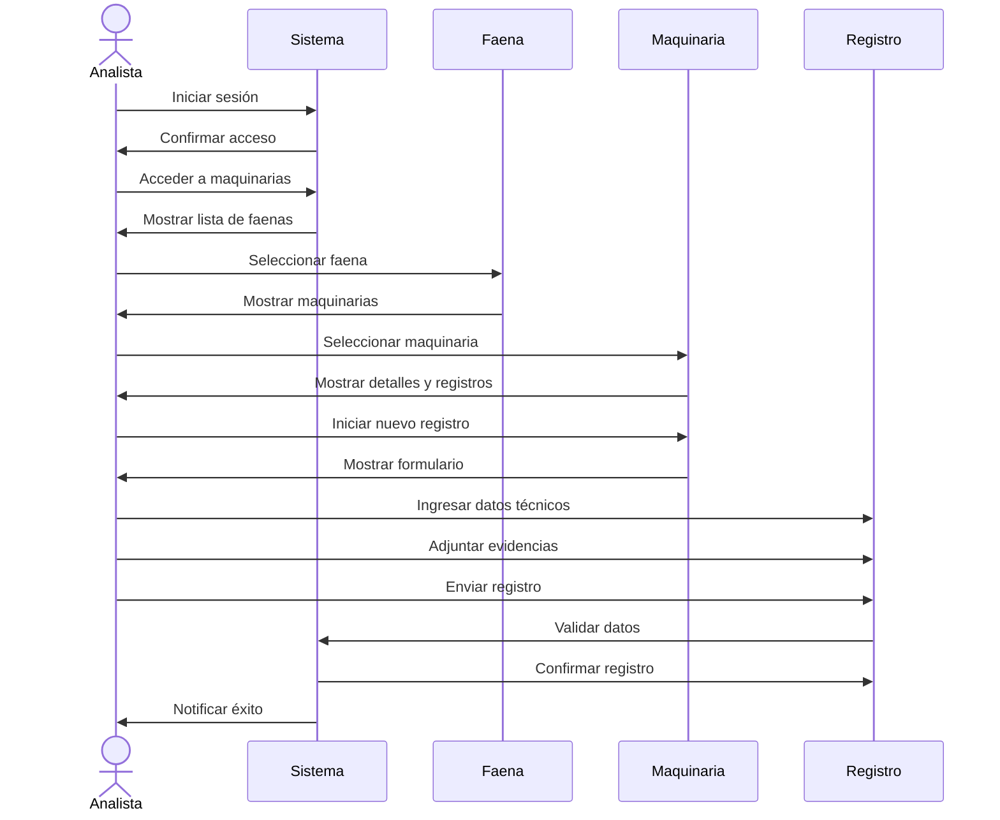
```mermaid
sequenceDiagram
    actor AN as Analista
    participant S as Sistema
    participant F as Faena
    participant M as Maquinaria
    participant R as Registro
    
    AN->>S: Iniciar sesión
    S->>AN: Confirmar acceso
    AN->>S: Acceder a maquinarias
    S->>AN: Mostrar lista de faenas
    AN->>F: Seleccionar faena
    F->>AN: Mostrar maquinarias
    AN->>M: Seleccionar maquinaria
    M->>AN: Mostrar detalles y registros
    AN->>M: Iniciar nuevo registro
    M->>AN: Mostrar formulario
    AN->>R: Ingresar datos técnicos
    AN->>R: Adjuntar evidencias
    AN->>R: Enviar registro
    R->>S: Validar datos
    S->>R: Confirmar registro
    S->>AN: Notificar éxito
```

### Diagrama de Estado: Estados de un Registro de Datos

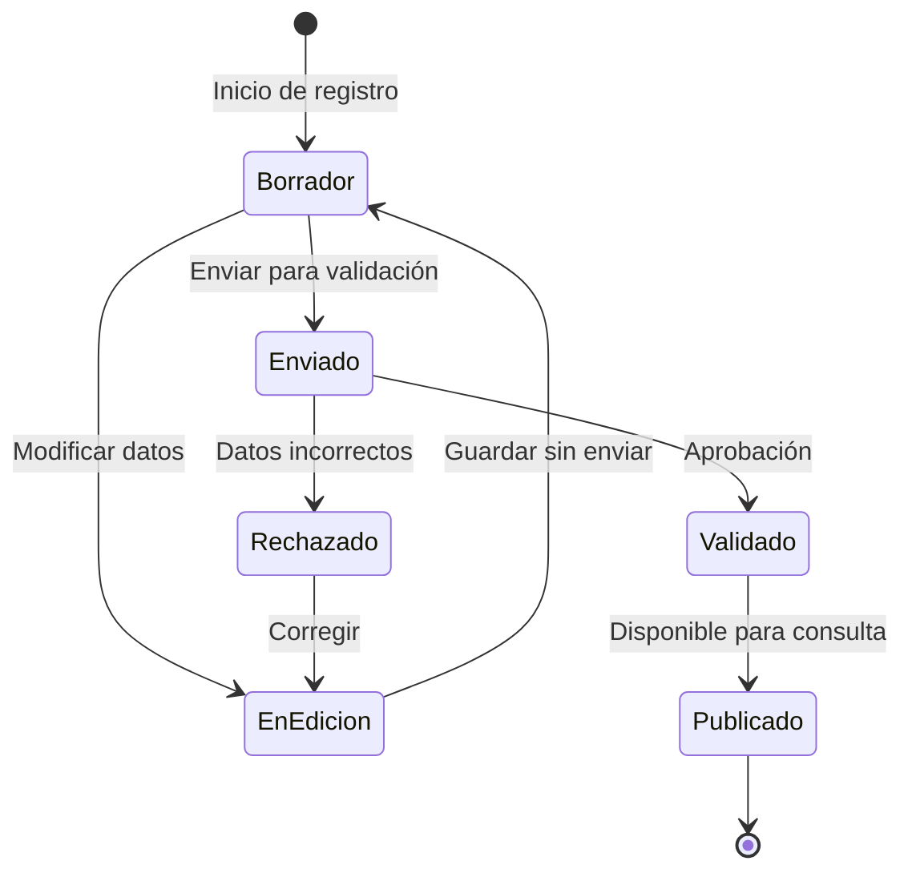
```mermaid
stateDiagram-v2
    [*] --> Borrador: Inicio de registro
    Borrador --> EnEdicion: Modificar datos
    EnEdicion --> Borrador: Guardar sin enviar
    Borrador --> Enviado: Enviar para validación
    Enviado --> Rechazado: Datos incorrectos
    Rechazado --> EnEdicion: Corregir
    Enviado --> Validado: Aprobación
    Validado --> Publicado: Disponible para consulta
    Publicado --> [*]
```

### Diagrama de Viaje del Usuario: Analista

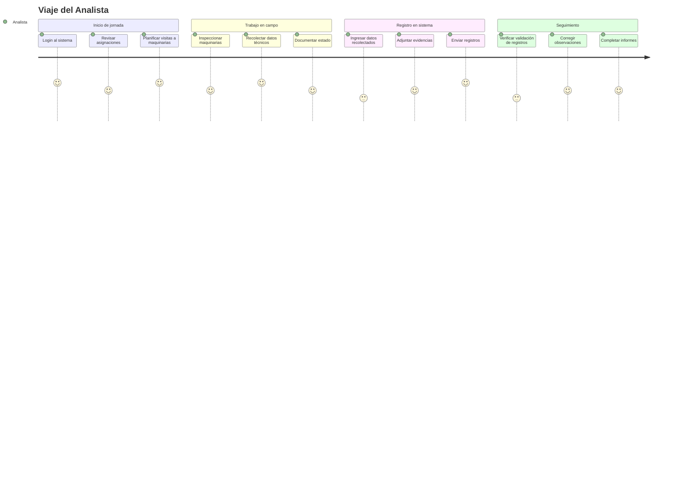
```mermaid
journey
    title Viaje del Analista
    section Inicio de jornada
      Login al sistema: 5: Analista
      Revisar asignaciones: 4: Analista
      Planificar visitas a maquinarias: 5: Analista
    section Trabajo en campo
      Inspeccionar maquinarias: 4: Analista
      Recolectar datos técnicos: 5: Analista
      Documentar estado: 4: Analista
    section Registro en sistema
      Ingresar datos recolectados: 3: Analista
      Adjuntar evidencias: 4: Analista
      Enviar registros: 5: Analista
    section Seguimiento
      Verificar validación de registros: 3: Analista
      Corregir observaciones: 4: Analista
      Completar informes: 4: Analista
```

---

## Rol: Supervisor

El Supervisor es responsable de monitorear el estado de las maquinarias, analizar los datos registrados por los analistas y gestionar alertas e intervenciones cuando sea necesario.

### Diagrama de Flujo: Monitoreo de Maquinarias

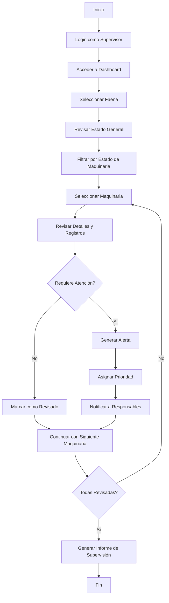
```mermaid
flowchart TD
    A[Inicio] --> B[Login como Supervisor]
    B --> C[Acceder a Dashboard]
    C --> D[Seleccionar Faena]
    D --> E[Revisar Estado General]
    E --> F[Filtrar por Estado de Maquinaria]
    F --> G[Seleccionar Maquinaria]
    G --> H[Revisar Detalles y Registros]
    H --> I{Requiere Atención?}
    I -->|No| J[Marcar como Revisado]
    I -->|Sí| K[Generar Alerta]
    K --> L[Asignar Prioridad]
    L --> M[Notificar a Responsables]
    J --> N[Continuar con Siguiente Maquinaria]
    M --> N
    N --> O{Todas Revisadas?}
    O -->|No| G
    O -->|Sí| P[Generar Informe de Supervisión]
    P --> Q[Fin]
```

### Diagrama de Secuencia: Consulta de Informes

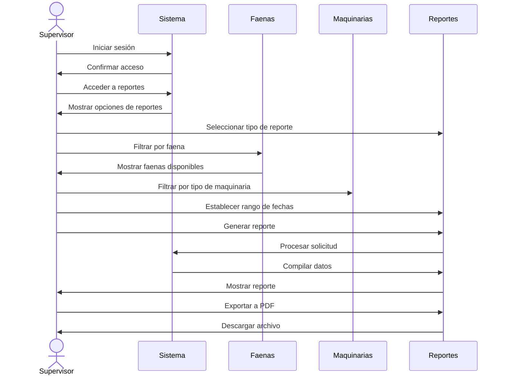
```mermaid
sequenceDiagram
    actor SU as Supervisor
    participant S as Sistema
    participant F as Faenas
    participant M as Maquinarias
    participant R as Reportes
    
    SU->>S: Iniciar sesión
    S->>SU: Confirmar acceso
    SU->>S: Acceder a reportes
    S->>SU: Mostrar opciones de reportes
    SU->>R: Seleccionar tipo de reporte
    SU->>F: Filtrar por faena
    F->>SU: Mostrar faenas disponibles
    SU->>M: Filtrar por tipo de maquinaria
    SU->>R: Establecer rango de fechas
    SU->>R: Generar reporte
    R->>S: Procesar solicitud
    S->>R: Compilar datos
    R->>SU: Mostrar reporte
    SU->>R: Exportar a PDF
    R->>SU: Descargar archivo
```

### Diagrama de Estado: Monitoreo de Estados de Maquinarias

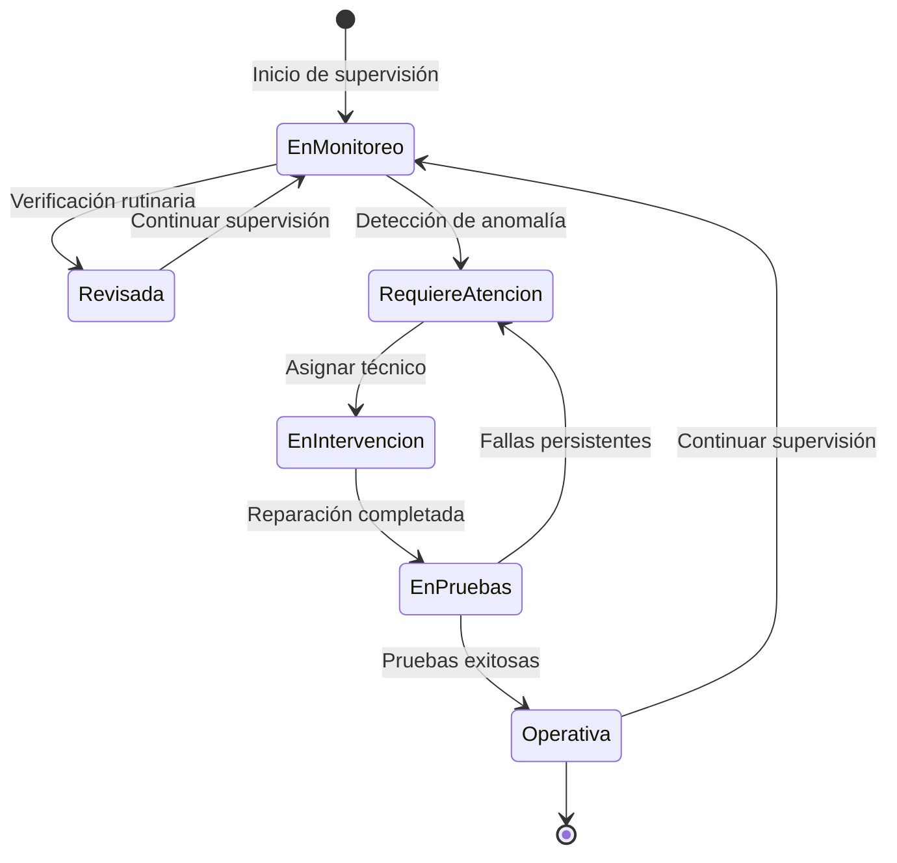
```mermaid
stateDiagram-v2
    [*] --> EnMonitoreo: Inicio de supervisión
    EnMonitoreo --> Revisada: Verificación rutinaria
    EnMonitoreo --> RequiereAtencion: Detección de anomalía
    RequiereAtencion --> EnIntervencion: Asignar técnico
    EnIntervencion --> EnPruebas: Reparación completada
    EnPruebas --> Operativa: Pruebas exitosas
    EnPruebas --> RequiereAtencion: Fallas persistentes
    Operativa --> EnMonitoreo: Continuar supervisión
    Revisada --> EnMonitoreo: Continuar supervisión
    Operativa --> [*]
```

### Diagrama de Viaje del Usuario: Supervisor

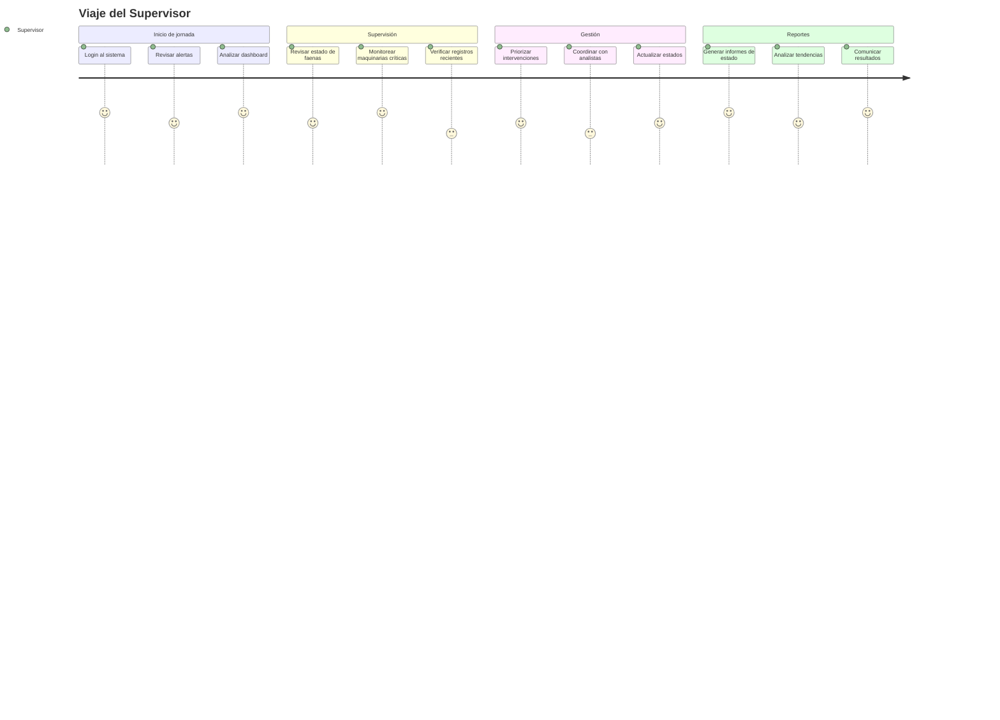
```mermaid
journey
    title Viaje del Supervisor
    section Inicio de jornada
      Login al sistema: 5: Supervisor
      Revisar alertas: 4: Supervisor
      Analizar dashboard: 5: Supervisor
    section Supervisión
      Revisar estado de faenas: 4: Supervisor
      Monitorear maquinarias críticas: 5: Supervisor
      Verificar registros recientes: 3: Supervisor
    section Gestión
      Priorizar intervenciones: 4: Supervisor
      Coordinar con analistas: 3: Supervisor
      Actualizar estados: 4: Supervisor
    section Reportes
      Generar informes de estado: 5: Supervisor
      Analizar tendencias: 4: Supervisor
      Comunicar resultados: 5: Supervisor
```

---

## Consideraciones de Implementación

La implementación del sistema Multotec sigue estrictamente el patrón de Arquitectura Hexagonal (también conocida como Arquitectura de Puertos y Adaptadores), lo que permite una clara separación entre la lógica de negocio y los detalles técnicos de infraestructura.

### Enfoque de Arquitectura Hexagonal

La arquitectura hexagonal organiza el código en tres capas principales:

1. **Capa de Dominio (Núcleo)**
   - Contiene entidades de dominio puras que representan el modelo de negocio
   - Define interfaces (puertos) para interactuar con sistemas externos
   - Implementa reglas de negocio y validaciones independientes de infraestructura
   - No tiene dependencias con frameworks o librerías externas

2. **Capa de Aplicación**
   - Orquesta los casos de uso utilizando entidades del dominio
   - Implementa la lógica de aplicación que coordina las operaciones
   - Utiliza DTOs para transferir datos entre capas
   - Se comunica con el dominio y los adaptadores a través de interfaces

3. **Capa de Infraestructura**
   - Implementa adaptadores concretos para los puertos definidos en el dominio
   - Gestiona detalles técnicos como base de datos, API REST, autenticación
   - Convierte entre formatos de datos externos y modelos de dominio
   - Mantiene dependencias con frameworks y tecnologías específicas

### Implementación por Fases

El desarrollo del sistema se realizará en fases incrementales:

#### Fase 1: MVP (Producto Mínimo Viable)
- Implementación de funcionalidades core para los cuatro roles
- Modelo de datos completamente normalizado en 3NF
- Estructura de arquitectura hexagonal establecida
- Enfoque en los flujos principales de gestión y monitoreo

#### Fase 2: Ampliación de Funcionalidades
- Implementación de notificaciones y alertas
- Sistema de mantenimiento programado
- Gestión de documentos
- Mejoras en reportes y dashboards

#### Fase 3: Optimización y Escalabilidad
- Mejoras de rendimiento
- Implementación de caching
- Escalado horizontal para soportar mayor volumen de datos
- Integración con sistemas externos

### Tecnologías Seleccionadas

#### Backend
- **Framework**: FastAPI
- **ORM**: SQLAlchemy
- **Base de datos**: PostgreSQL
- **Contenedores**: Docker
- **Gestión de dependencias**: Poetry

#### Frontend
- **Framework**: React
- **Gestión de estado**: Redux
- **UI Component Library**: Material-UI
- **Build tool**: Vite

#### Infraestructura
- **CI/CD**: GitHub Actions
- **Hosting**: AWS/GCP
- **Monitoreo**: Prometheus + Grafana

### Consideraciones de Seguridad

- Autenticación basada en JWT con refresh tokens
- Autorización basada en roles y permisos
- Validación de entradas en múltiples niveles
- Cifrado de datos sensibles en tránsito y reposo
- Auditoría completa de acciones del sistema

### Implicaciones de la Arquitectura Hexagonal

La adopción de la arquitectura hexagonal proporciona beneficios importantes:

1. **Mantenibilidad**: Estructura clara que facilita entender y modificar el código
2. **Testabilidad**: Capas de dominio y aplicación fácilmente testeables
3. **Flexibilidad**: Posibilidad de cambiar detalles técnicos sin afectar la lógica de negocio
4. **Evolución**: Facilita la evolución incremental del sistema
5. **Independencia tecnológica**: El dominio no depende de tecnologías específicas

Este documento presenta una visión consolidada del proyecto Multotec. Para más detalles sobre cada aspecto, consulte los documentos específicos referenciados. 