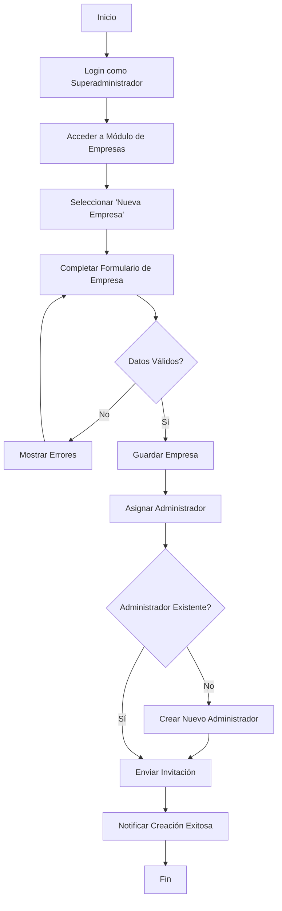
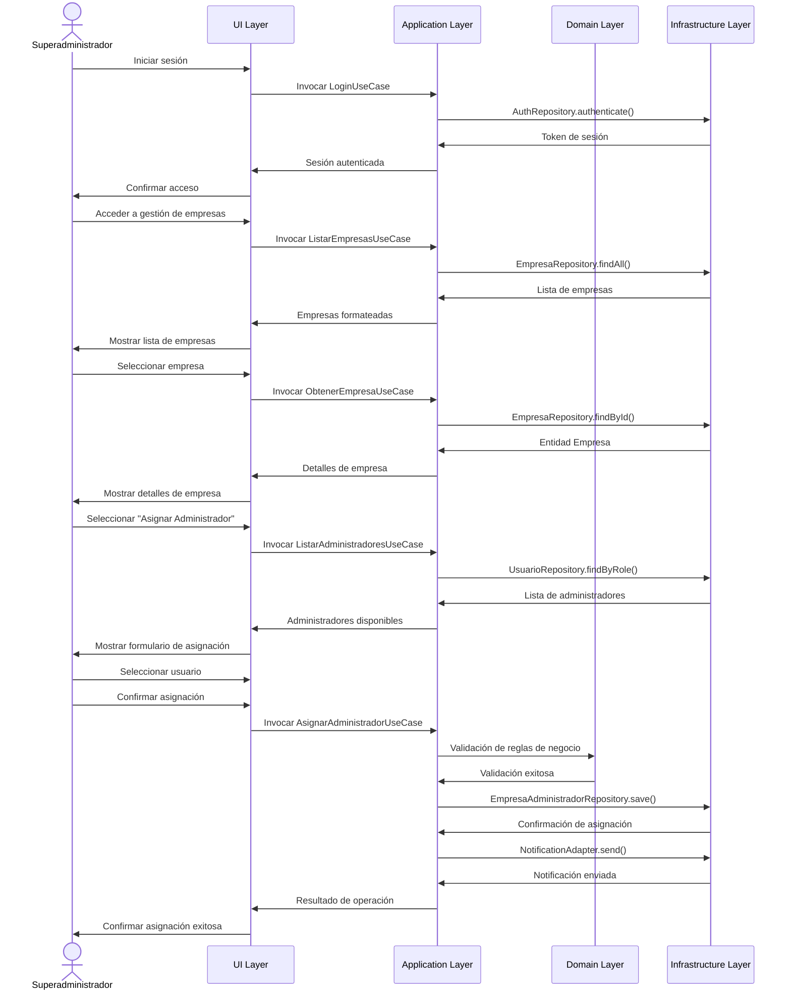
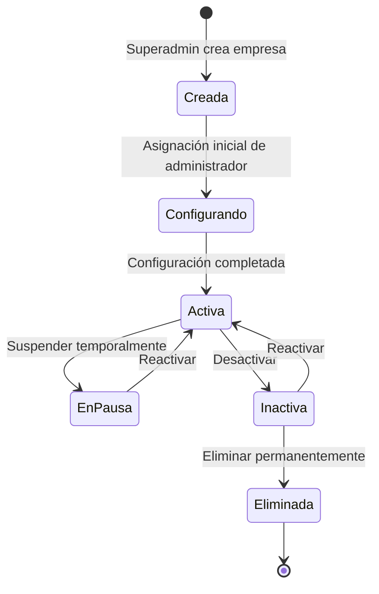
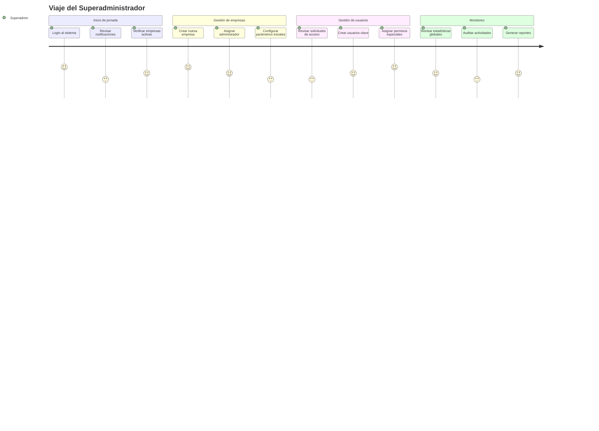

# Flujos de Usuario: Superadministrador

Este documento presenta los diagramas que ilustran los flujos y procesos del Superadministrador en el sistema Multotec, alineados con la implementación de arquitectura hexagonal.

## Diagrama de Flujo: Creación de Empresa

## Diagrama de Secuencia: Asignación de Administrador a Empresa

## Diagrama de Estado: Ciclo de Vida de una Empresa

## Diagrama de Viaje del Usuario: Superadministrador

## Implementación en Arquitectura Hexagonal

La implementación de los flujos del Superadministrador sigue estrictamente los principios de la arquitectura hexagonal, separando claramente las diferentes capas de la aplicación.

### 1. Capa de Dominio

**Entidades principales:**
- `Empresa`: Entidad central para la gestión de empresas
- `Usuario`: Entidad que representa a los administradores y otros tipos de usuarios
- `EmpresaAdministrador`: Entidad que representa la relación entre una empresa y sus administradores

**Interfaces de Repositorio (Puertos):**
- `EmpresaRepositoryInterface`: Define operaciones para persistir y recuperar empresas
- `UsuarioRepositoryInterface`: Define operaciones para gestionar usuarios
- `EmpresaAdministradorRepositoryInterface`: Define operaciones para gestionar las relaciones

**Servicios de Dominio:**
- `EmpresaValidacionService`: Implementa reglas de negocio para validación de empresas
- `AdministradorValidacionService`: Implementa reglas de negocio para validación de administradores

### 2. Capa de Aplicación

**Casos de Uso:**
- `CrearEmpresaUseCase`: Orquesta la creación de una nueva empresa
- `ListarEmpresasUseCase`: Recupera el listado de empresas según criterios
- `AsignarAdministradorUseCase`: Gestiona la asignación de un administrador a una empresa
- `CambiarAdministradorPrincipalUseCase`: Cambia el administrador principal de una empresa
- `DesactivarEmpresaUseCase`: Desactiva una empresa en el sistema

**DTOs (Objetos de Transferencia de Datos):**
- `EmpresaDTO`: Representa los datos de una empresa para transferencia entre capas
- `AdministradorDTO`: Representa los datos de un administrador para transferencia
- `EmpresaAdministradorDTO`: Representa la relación para transferencia entre capas

### 3. Capa de Infraestructura

**Controladores API:**
- `EmpresaController`: Maneja las peticiones HTTP relacionadas con empresas
- `AdministradorController`: Maneja las peticiones HTTP relacionadas con administradores
- `EmpresaAdministradorController`: Maneja las peticiones para gestionar relaciones

**Adaptadores de Repositorio:**
- `SQLAlchemyEmpresaRepository`: Implementación concreta del repositorio de empresas
- `SQLAlchemyUsuarioRepository`: Implementación concreta del repositorio de usuarios
- `SQLAlchemyEmpresaAdministradorRepository`: Implementación para las relaciones

**Seguridad y Autorización:**
- `RoleMiddleware`: Middleware para validar roles de usuario en las peticiones
- `RoleRequired`: Decorador para proteger endpoints según el rol requerido

### Flujo de Datos en Arquitectura Hexagonal

1. **Petición de Usuario**: El Superadministrador interactúa con la UI
2. **Controlador API**: Recibe la petición y la transforma en una llamada al caso de uso
3. **Caso de Uso**: Coordina la lógica de aplicación utilizando entidades de dominio
4. **Entidades de Dominio**: Aplican reglas de negocio
5. **Repositorios**: Los casos de uso interactúan con las interfaces de repositorio
6. **Adaptadores de Repositorio**: Implementan la persistencia real de datos
7. **Respuesta**: El resultado fluye de vuelta siguiendo el mismo camino inverso

### Beneficios para el Flujo del Superadministrador

- **Separación de Responsabilidades**: Cada capa tiene un propósito claro
- **Testabilidad Mejorada**: Las capas de dominio y aplicación son fácilmente testeables
- **Independencia de Infraestructura**: El dominio no depende de detalles de implementación
- **Flexibilidad para Cambios**: Es posible cambiar la tecnología de persistencia o UI sin afectar la lógica de negocio
- **Mantenibilidad**: Estructura clara que facilita el mantenimiento futuro 