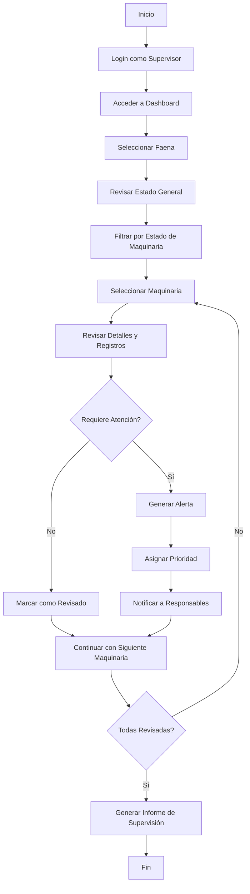
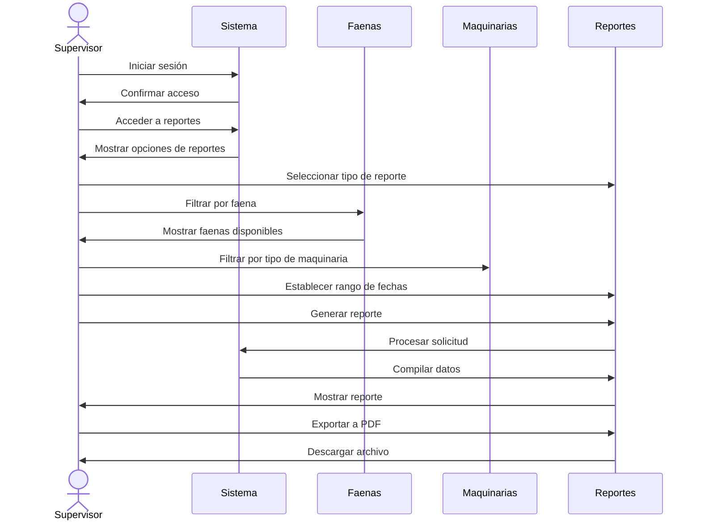
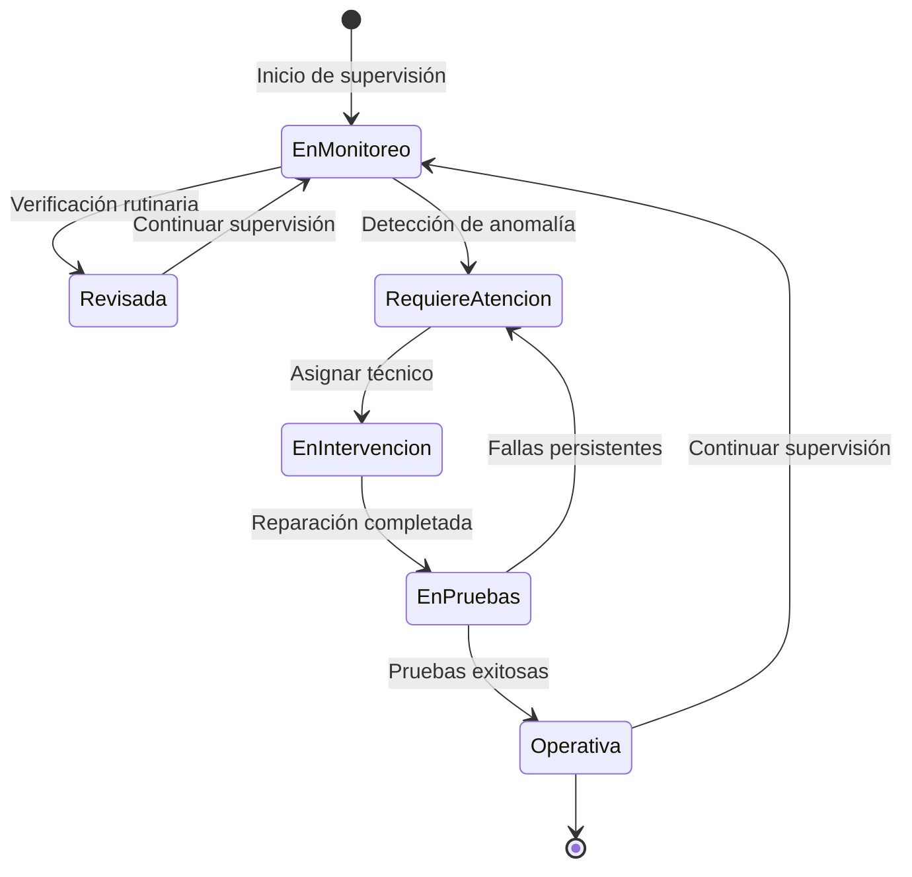
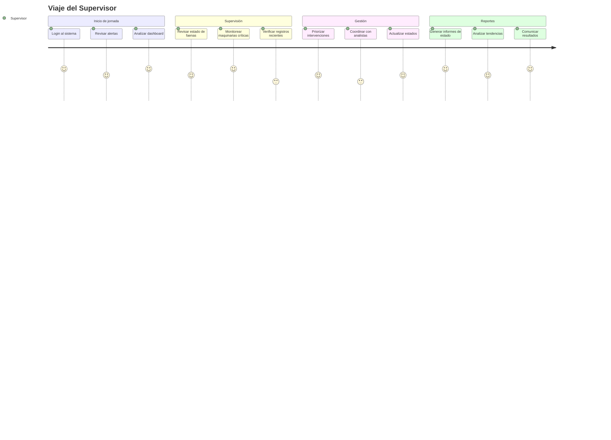

# Flujos de Usuario: Supervisor

Este documento presenta los diagramas que ilustran los flujos y procesos del Supervisor en el sistema Multotec.

## Diagrama de Flujo: Monitoreo de Maquinarias

## Diagrama de Secuencia: Consulta de Informes

## Diagrama de Estado: Monitoreo de Estados de Maquinarias

## Diagrama de Viaje del Usuario: Supervisor

